### 前言
因为自己刚学完 vue3 的课程，还没有具体的项目来练手，就想着拿着市面很很火的 “ruoyi” 后台管理来练手。我选选择的
<a href= "https://gitee.com/y_project/RuoYi-Vue">前后端分离版本</a>。但是我需要包含接口文档的，这个仓库本身本身有引入 swagger，但是并没有完全实现，只给了实例，因此可以在这个仓库中我将 swagger + knife4j 整合，并且实现了全部接口文档，
<a href= "https://gitee.com/y_project/RuoYi-Vue">前后端分离版本（包含接口文档）</a>。<br>
注意一点：<br>
- 数据库相关 sql，自己在创建完数据库后在执行；

  

- 自己根据配置文件修改 mysql 的链接地址和数据库名称，还有 redis 的地址；

  

  
---
### 环境介绍

| 类别           | 详情                             |
| -------------- | -------------------------------- |
| 电脑及系统版本 | MacBook Pro Apple M1 Pro、14.1.2 |
| node 版本      | v18.20.2                         |
| 下载工具       | pnpm                             |
| 框架           | vue3                             |
| 构建工具       | vite                             |
| 组件           | Element-plus                     |
| 开发工具       | WebStorm 2024.1.2                |
| TS的语法       | 没有使用，纯 JS                  |
---
### 开始前建议

- 界面设计参考，若依在线的体验地址<a herf='https://vue.ruoyi.vip/login'>相关跳转</a>
- 页面不会写的借助 ChatGPT 来写<a herf='https://chatgpt.com/'>相关跳转</a>
- 遇到不会的问题：ChatGPT、百度、Chrome
---
### 项目创建

1. 项目创建

   ```bash
   pnpm create vite
   ```

   

2. 设置项目名称

   ```bash
   ruoyi-ui
   ```

   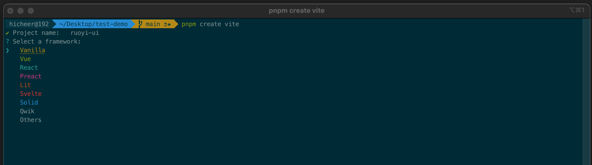

3. 框架选择

   ```bash
   vue
   ```

   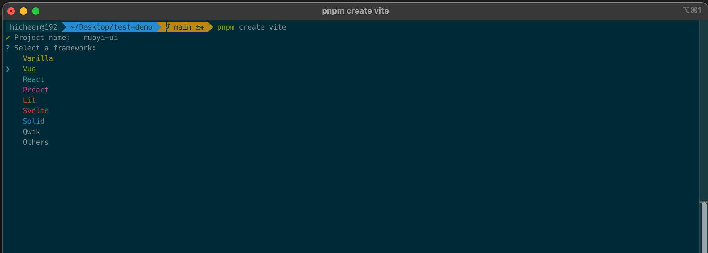

4. 数据类型选择

   ```bash
   JavaScript
   ```

   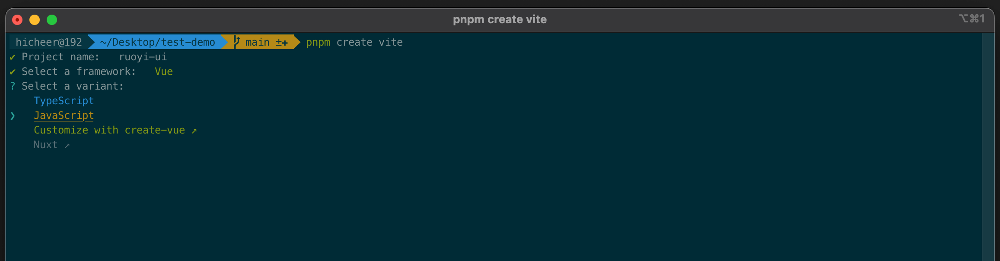

5. 创建完成

   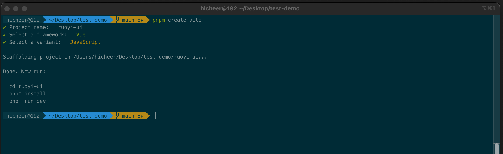

---

### 开发工具打开项目

1. 开发工具中打开项目

   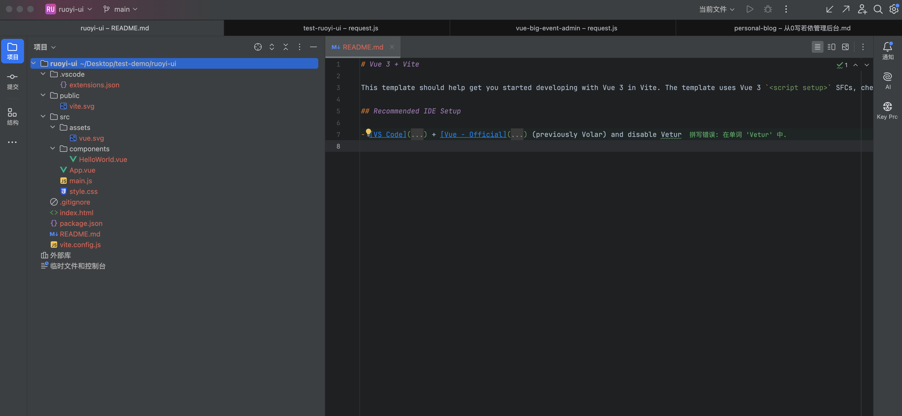

2. 安装相关依赖（注意是项目的根目录下）

   ```bash
   pnpm install
   ```

   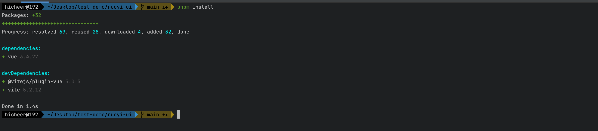

3. 运行项目

   ```bash
   pnpm run dev
   ```

   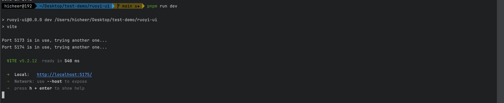

4. 点击链接

   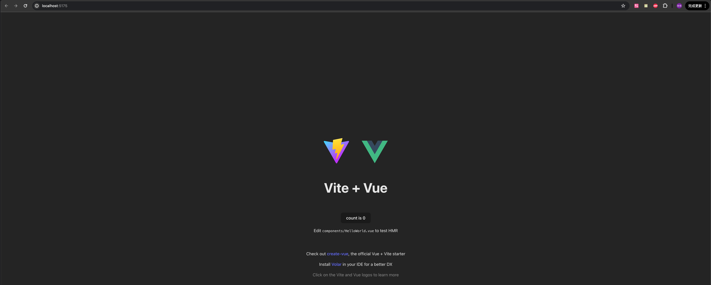

---

### 创建企业开发项目目录

1. 删除项目本身自带的文件

   删除前：

   

   删除后：

   

2. 删除 App.vue 中没有的代码

   删除前：

   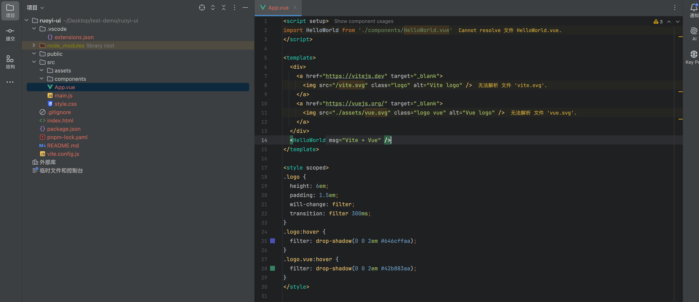

   删除后：

   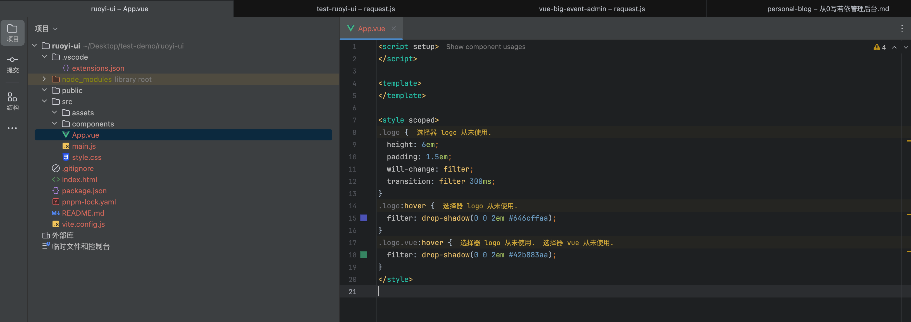

3. 创建目录

   ```text
   api --- 后台接口
   assets --- 相关资源（图片等）
   component --- 组件
   layout --- 布局
   plugins --- 插件
   router --- 路由
   views --- 视图（页面）
   ```

   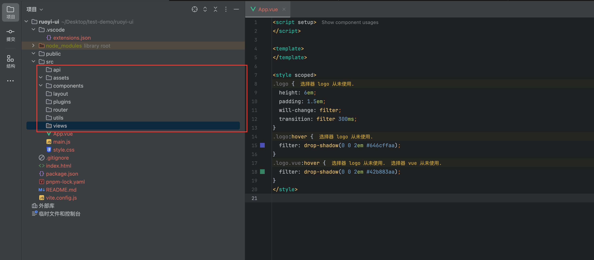
---
### 登录/注册页面

1. 创建登录/注册页面

   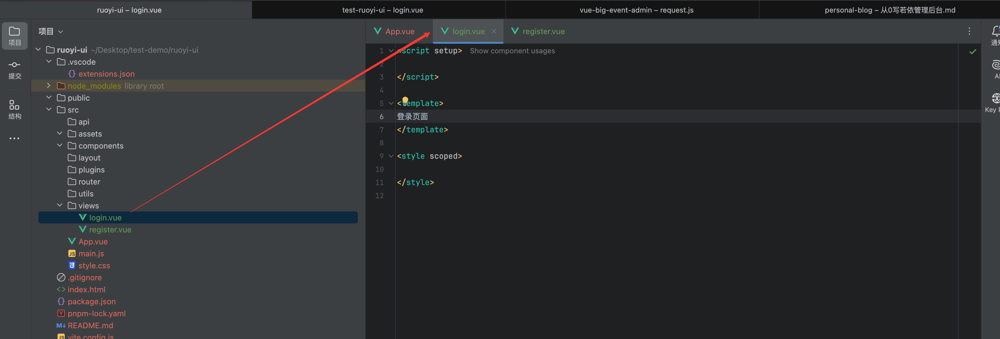

   

2. 根目录配置

   在开发期间我们为了便于文件之间相互引用，一般是相对路径/绝对路径，再不然是项目根路径，我们一般都只在 src 目录下开发，所以我们配置一个‘@’符号表示 src 在项目中的路径，因此在表示路径的时候只需要‘@/views/login.vue’，就可以指向该文件。下面有具体的引入和使用。

   - 设置“@”

     ```js
     import { fileURLToPath, URL } from 'node:url'
     resolve: {
       	// 别名
         alias: {
           // 设置 @ 符号为 ‘src’的根路径
           '@': fileURLToPath(new URL('./src', import.meta.url))
         }
     }
     ```

     

   - 使用方式

     后面的文章中有具体的使用方式，这里不做示例。

3. 配置路由

   - 安装路由插件（<a href='https://router.vuejs.org/zh/installation.html'>官方文档</a>）

     ```
     pnpm add vue-router@4
     ```

     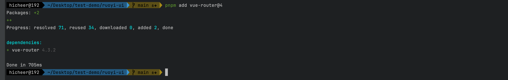

   - 创建路由，并配置登录与注册的路由

     ```js
     import { createWebHashHistory, createRouter } from 'vue-router'
     
     // 路由地址信息
     const routes = [
     	{ path: "/login", component: () => import('@/views/login.vue') },
     	{ path: "/register", component: () => import('@/views/register.vue') },
     ]
     
     // 创建路由
     const router = createRouter({
     	// 忽略路由器的 URL
     	history: createWebHashHistory(),
     	// 配置路由信息
     	routes,
     })
     
     export default router
     ```

     

   - 将路由注册到项目中

     ```js
     import router from "@/router/index.js";
     
     createApp(App)
     	.use(router)
     	.mount('#app')
     ```

     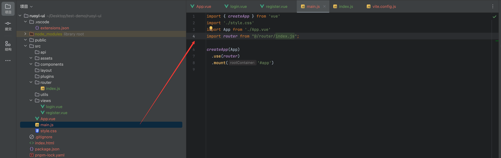

   - 将路由模块的页面引入到主页面中

     ```vue
     <router-view />
     ```

     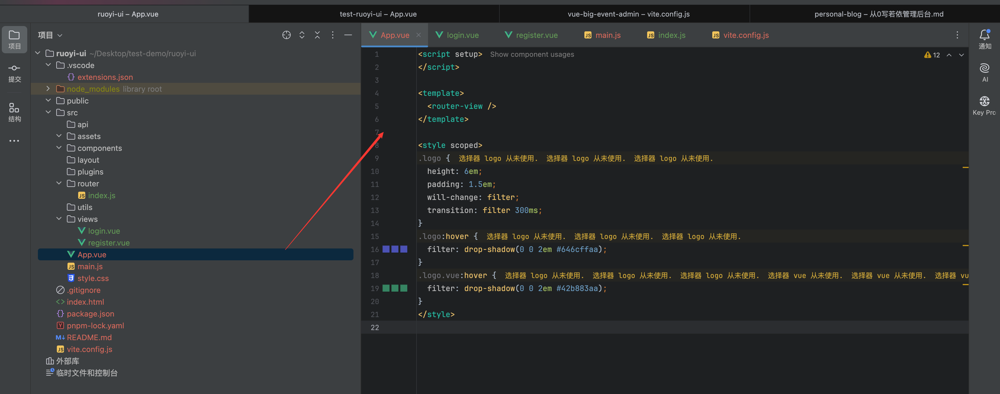

   - 测试页面是否配置成功

     

     

     OK，完成。
---
### 引入Element-Ui-plus

1. 官方文档

   <a herf='https://element-plus.org/zh-CN/guide/installation.html'></a>

2. 安装

   ```bash
   pnpm install element-plus
   ```

   

3. 导入（我选择按需导入，也是官方推荐）

   - 这里用到了官方插件，实现按需导入

     ```sql
     pnpm install -D unplugin-vue-components unplugin-auto-import
     ```

     

   - 配置插件

     ```js
     import AutoImport from 'unplugin-auto-import/vite'
     import Components from 'unplugin-vue-components/vite'
     import { ElementPlusResolver } from 'unplugin-vue-components/resolvers'
     
     AutoImport({
     	resolvers: [ElementPlusResolver()],
     }),
     Components({
     	resolvers: [ElementPlusResolver()],
     })
     ```

     
---
### 优化登录注册页面

注意：如果页面不会写，建议使用 ChatGPT 帮你生成一些基础的页面，再配合 Element-plus 官方文档进行调整，因为我就是这样开发的。

1. 美化登录页面

   - 基础美化

     ```vue
     <script setup>
     import { ref } from 'vue';
     import 'element-plus/theme-chalk/index.css';
     
     // 初始化表单
     const userForm = ref({
       username: '',
       password: '',
       captcha: '',
     });
     
     // 收集表单参数
     const form = ref()
     
     // 表单规则检验
     const userFormRules = {
       username: [
         { required: true, message: '请输入您的账号', trigger: 'blur' },
       ],
       password: [
         { required: true, message: '请输入您的密码', trigger: 'blur' },
       ],
       captcha: [
         { required: true, message: '请输入验证码', trigger: 'blur' },
       ]
     }
     
     const captchaUrl = ref('');
     
     const refreshCaptcha = () => {
       // 这里可以添加刷新验证码的逻辑
       captchaUrl.value = '';
     };
     
     // 登录提交
     const onSubmit = async () => {
     };
     
     </script>
     
     <template>
       <div class="login-container">
         <el-form
             :model="userForm"
             :rules="userFormRules"
             ref="form"
             label-width="0px">
           <h3 class="title" style="color: #707070">若依后台管理系统</h3>
           <el-form-item prop="username">
             <el-input
                 v-model="userForm.username"
                 placeholder="账号"
             >
             </el-input>
           </el-form-item>
           <el-form-item prop="password">
             <el-input
                 v-model="userForm.password"
                 type="password"
                 placeholder="密码"
             >
             </el-input>
           </el-form-item>
           <el-form-item prop="captcha">
             <el-row :gutter="20">
               <el-col :span="14">
                 <el-input
                     v-model="userForm.captcha"
                     placeholder="验证码"
                 >
                 </el-input>
               </el-col>
               <el-col :span="10">
                 
               </el-col>
             </el-row>
           </el-form-item>
           <el-form-item>
             <el-button type="primary" @click="onSubmit" style="width: 100%;">登录</el-button>
           </el-form-item>
         </el-form>
       </div>
     </template>
     
     <style scoped>
     .login-container {
       max-width: 400px;
       margin: auto;
       padding: 20px;
       background: white;
       border-radius: 8px;
       box-shadow: 0 2px 12px rgba(0, 0, 0, 0.1);
     }
     .captcha-img {
       cursor: pointer;
       border: 1px solid #dcdfe6;
       height: 40px;
     }
     </style>
     ```

     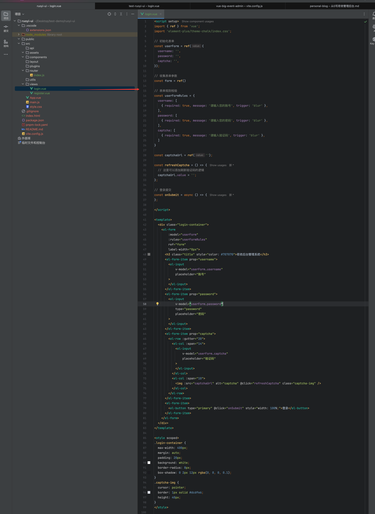

     页面展示

     

   - 进阶（在 input 输入框上加图标）

     安装 element-icon 库<a herf='https://element-plus.org/zh-CN/component/icon.html'>官方文档</a>

     ```bash
     pnpm install @element-plus/icons-vue
     ```

     

     根据官方文档说明插入

     <a herf='https://element-plus.org/zh-CN/component/input.html'>input 官方文档</a>

     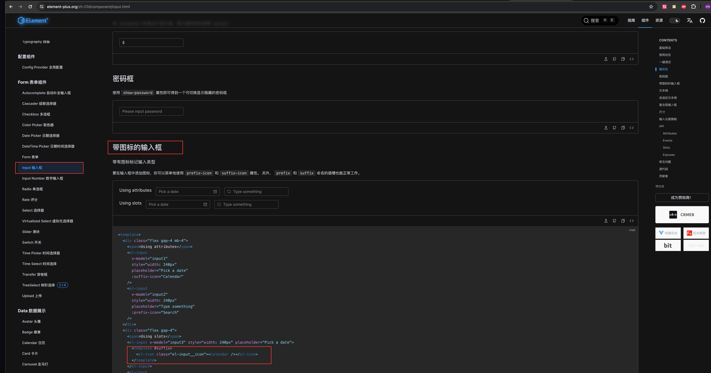

     我的代码

     

     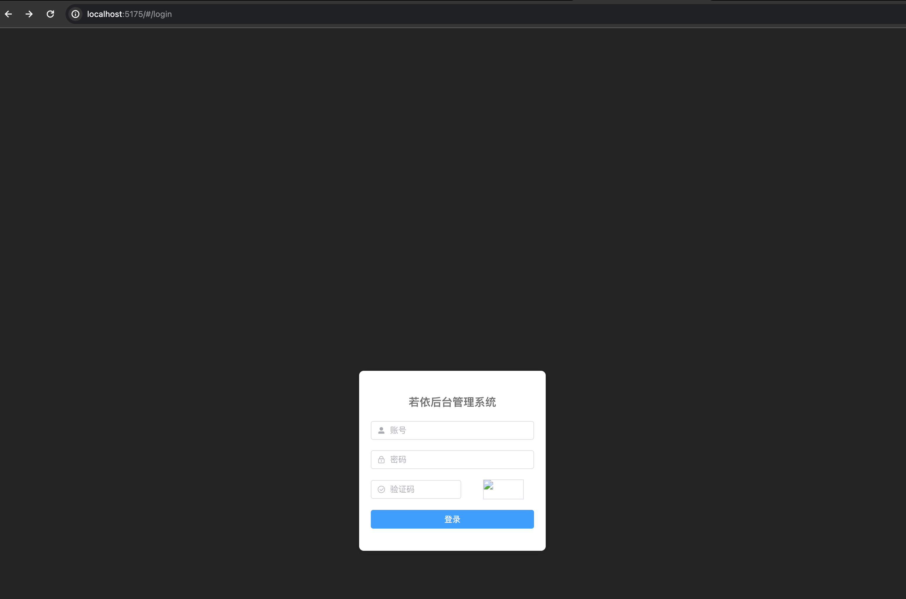

2. 美化注册页面（这里就不贴代码了）

   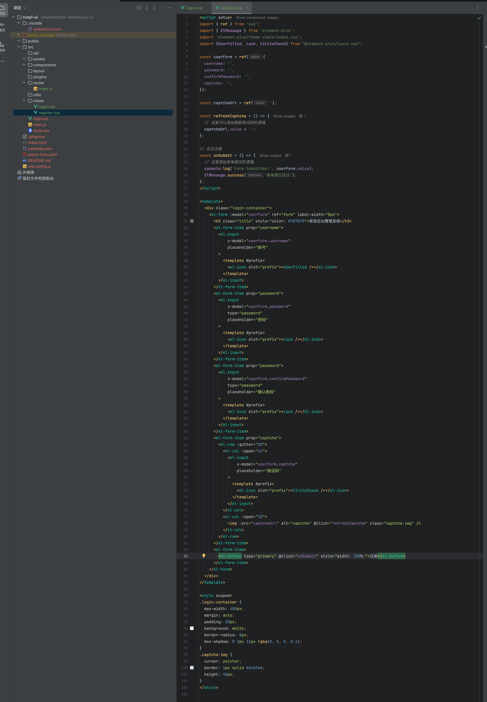

   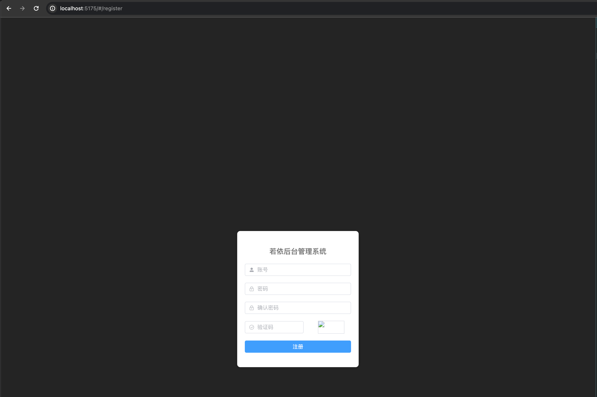

3. 登录页面与注册页面相互跳转

   - 登录页面跳转注册页

     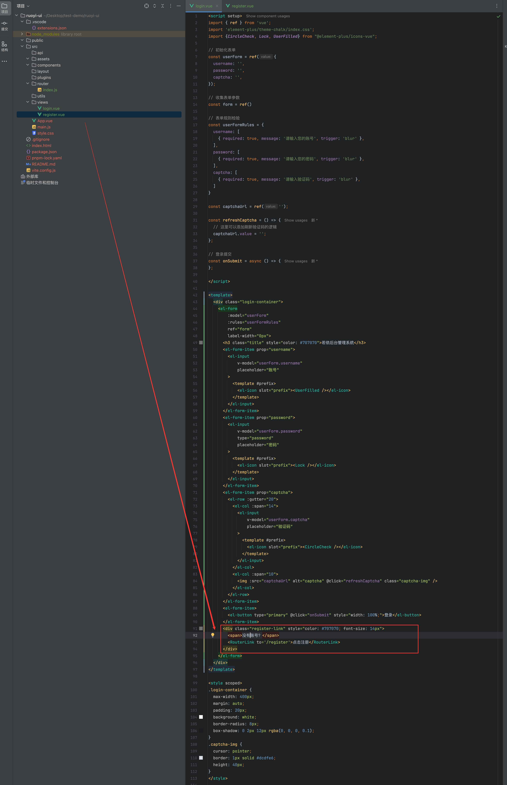

     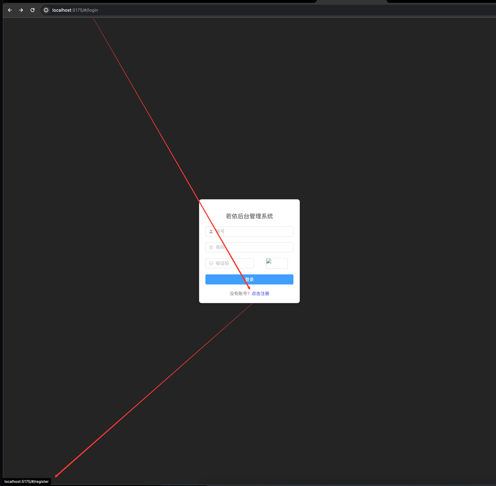

   - 注册页面跳转登录页面

     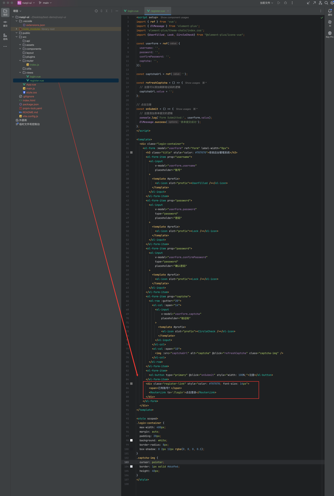

     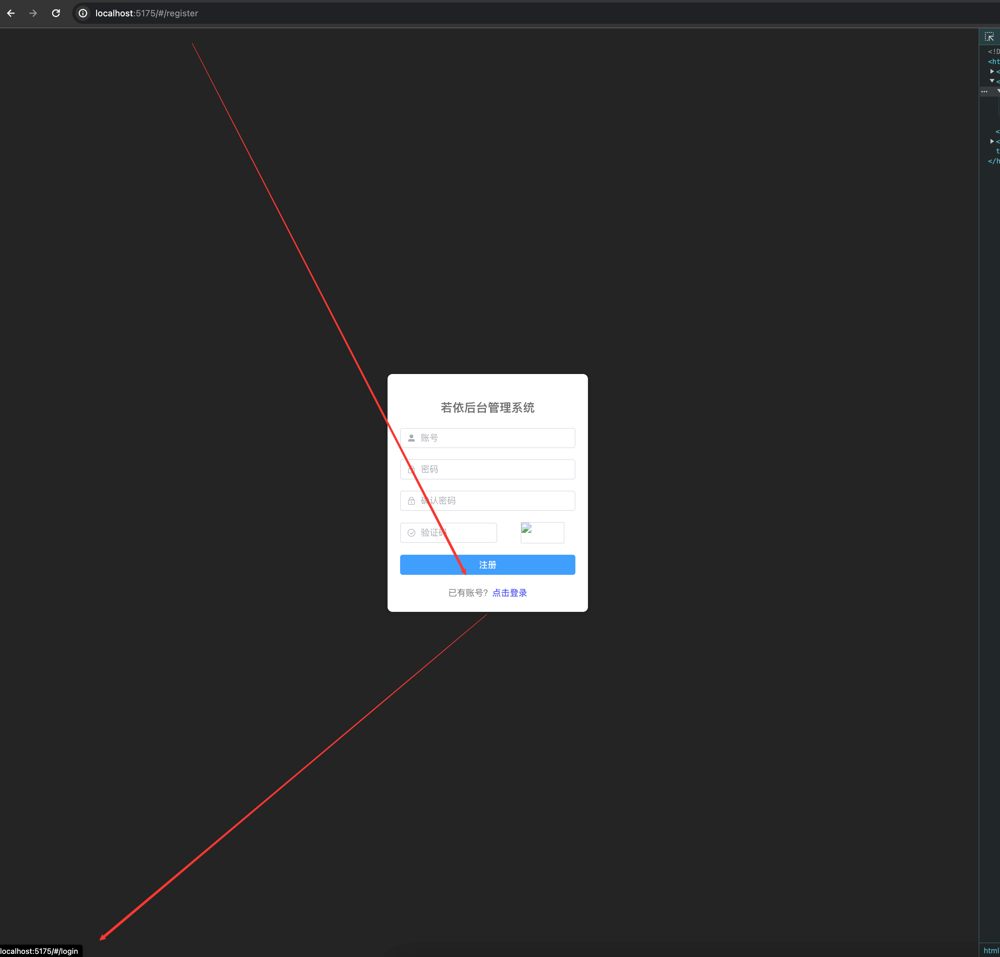
---
### 配置统一发送请求对象
1. 安装axios

   <a href='https://axios-http.com/zh/docs/intro'>官网地址</a>

   ```
   pnpm install axios
   ```

   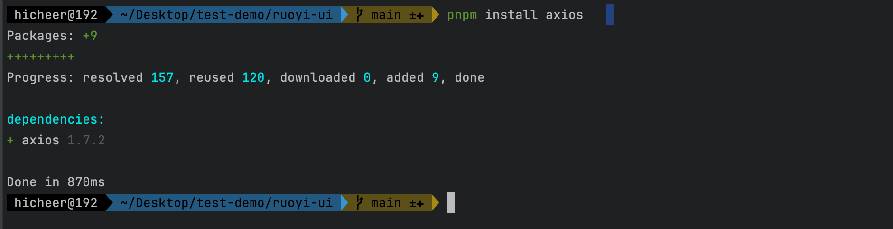

2. 创建`request.js`类

   添加添加公共方法、设置请求基地址（baseURL）,设置拦截器

   ```js
   import axios from 'axios'
   
   // 请求地址
   const baseURL = 'http://localhost:8080'
   // 公共请求方法
   const instance = axios.create({
   	baseURL,
   	timeout: 5000,
   })
   
   // 添加请求拦截器
   axios.interceptors.request.use(function (config) {
   	// 在发送请求之前做些什么
   	return config;
   }, function (error) {
   	// 对请求错误做些什么
   	return Promise.reject(error);
   });
   
   // 添加响应拦截器
   axios.interceptors.response.use(function (response) {
   	// 2xx 范围内的状态码都会触发该函数。
   	// 对响应数据做点什么
   	return response;
   }, function (error) {
   	// 超出 2xx 范围的状态码都会触发该函数。
   	// 对响应错误做点什么
   	return Promise.reject(error);
   });
   
   ```

   

   这些在官网都有介绍，直接拷贝使用，具体的拦截器逻辑自己根据业务实现。

---

### 获取验证码

1. 首先是要在本地将`ruoyi`项目启动起来的


接口文档地址

```http
http://localhost:8080/doc.html#/home
```


例如：验证码，


接口地址的前缀

```http
http://localhost:8080
```


接口的名称

```http
/captchaImage
```

2. 创建关于获取验证码 API 的 JS 页面

   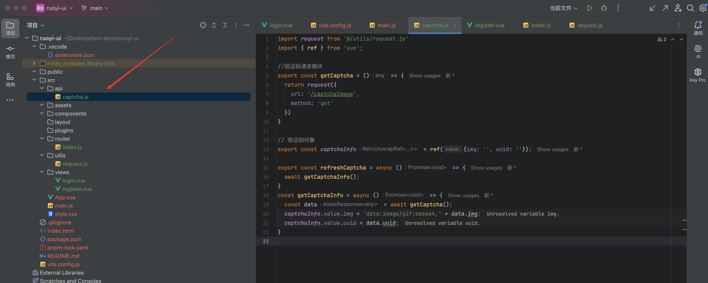

   相关代码（注意：代码上面的注释，对每个部分做了解释）

   ```js
   import request from '@/utils/request.js'
   import { ref } from 'vue';
   
   // 验证码请求模块
   export const getCaptcha = () => {
   	return request({
       // 接口地址
   		url: '/captchaImage',
       // 请求类型
   		method: 'get'
   	})
   }
   
   // 初始化验证码对象，我们只需要验证码中的两个参数即可，其他参数不需要
   export const captchaInfo = ref({img: '', uuid: ''});
   
   // 点击验证码图片，重新获取验证码；这里对应登录/注册页面中验证码点击事件
   export const refreshCaptcha = async () => {
   	await getCaptchaInfo();
   }
   
   // 解析验证码请求返回后响应参数，然后给验证码对象赋值
   const getCaptchaInfo = async () => {
   	const data = await getCaptcha();
     // base64图片拼接，加上前缀 'data:image/gif;base64,'，图片才可以被浏览器解析
   	captchaInfo.value.img = 'data:image/gif;base64,' + data.img;
   	captchaInfo.value.uuid = data.uuid;
   }
   
   ```

   为什么将这一块全部写在这里：因为这些方法在登录页面和注册页面都是用到，卸载同一个地方，方便维护。

3. 登录页面 `login.vue`

   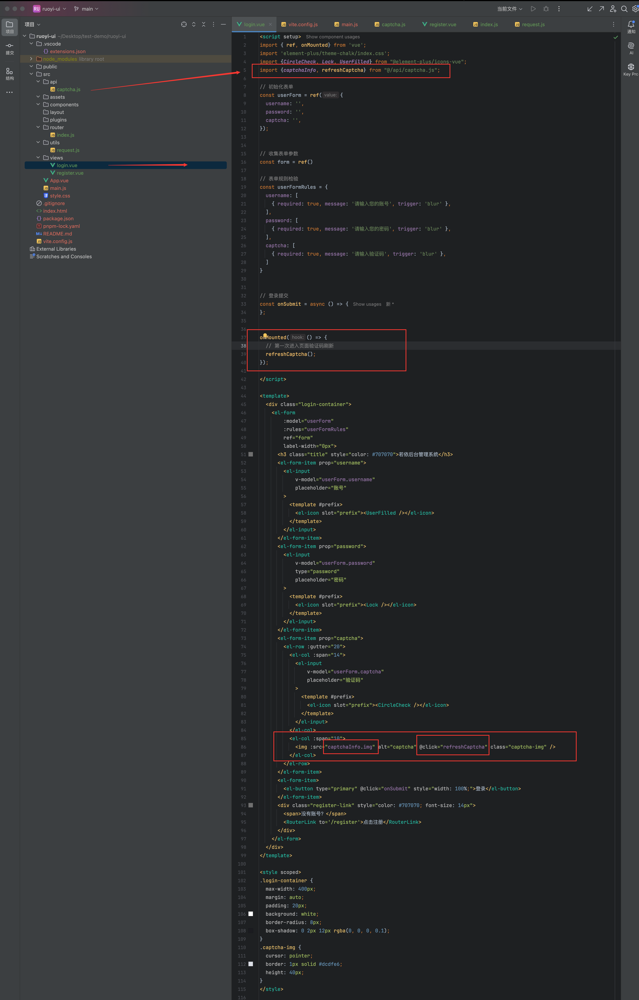

   引入 captchaInfo对象、refreshCaptcha方法

   ```js
   import {captchaInfo, refreshCaptcha} from "@/api/captcha.js";
   ```

   一进页面就加载

   ```js
   onMounted(() => {
     // 第一次进入页面验证码刷新
     refreshCaptcha();
   });
   ```

   验证码相关的代码

   ```vue
   <el-col :span="10">
   	
   </el-col>
   ```

4. 最后注意一下，`request.js` 我这里做了简单的调整

   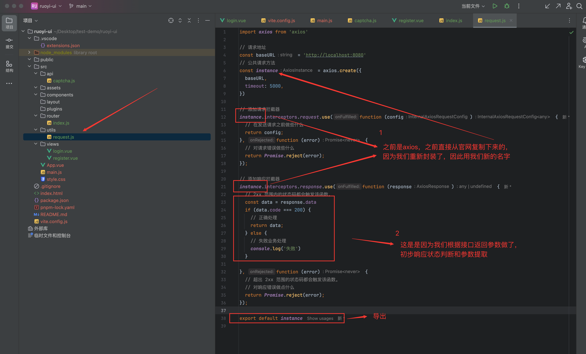

   我们前面说过根据自己的接口响应参数结构做出一些调整。

   ```js
   import axios from 'axios'
   
   // 请求地址
   const baseURL = 'http://localhost:8080'
   // 公共请求方法
   const instance = axios.create({
   	baseURL,
   	timeout: 5000,
   })
   
   // 添加请求拦截器
   instance.interceptors.request.use(function (config) {
   	// 在发送请求之前做些什么
   	return config;
   }, function (error) {
   	// 对请求错误做些什么
   	return Promise.reject(error);
   });
   
   // 添加响应拦截器
   instance.interceptors.response.use(function (response) {
   	// 2xx 范围内的状态码都会触发该函数。
   	const data = response.data
   	if (data.code === 200) {
   		// 正确处理
   		return data;
   	} else {
   		// 失败业务处理
   		console.log('失败')
   	}
   
   }, function (error) {
   	// 超出 2xx 范围的状态码都会触发该函数。
   	// 对响应错误做点什么
   	return Promise.reject(error);
   });
   
   export default instance
   ```

5. 效果

   

   <span style="color: yellow;">注意一下，因为我是先自己做，后整理的文档，有些文档衔接的不是很好，比如现在这里的页面背景色是黑色，后面就就会变成其他背景色；这就是因为我先自己做后面再整理文档，有些没有处理好文章的上下文，但是没关系，你看到诸如此类的问题后面的文章的流程中会补回来的，别担心，感谢包容！</span>

6. 注册页面`register.vue`相同（自己从上面复制相关代码）

   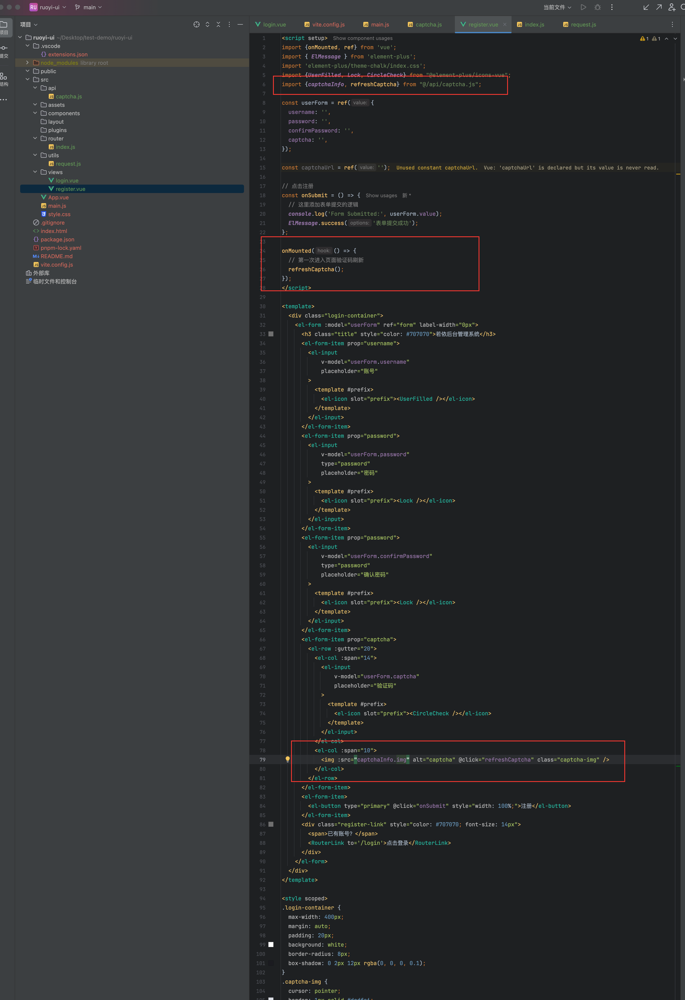

### 登录接口

1. 分析接口文档

   

   请求参数

   ```json
   {
     "code": "",  // 验证码（这个是获取验证码图片后，根据图片计算出来的）
     "password": "", // 密码（默认：admin123）
     "username": "", // 账户（默认：admin）
     "uuid": "" // uuid（之前在获取的验证码的时候，返回来的参数）
   }
   ```

2. 分析相应结构

   首先，调用一下接口

   ```json
   {
     "code": "",  // 自己调用获取验证码接口自己填写
     "password": "admin123", // 密码（默认：admin123）
     "username": "admin", // 账户（默认：admin）
     "uuid": "" // 自己调用获取验证码接口自己填写
   }
   ```

   注意：`uuid`与`code`他们呢是一组对应的，而且用完后后台会将 uuid 从 redis 中清除，为了方便调试我们可以直接不做跳过验证码校验。

   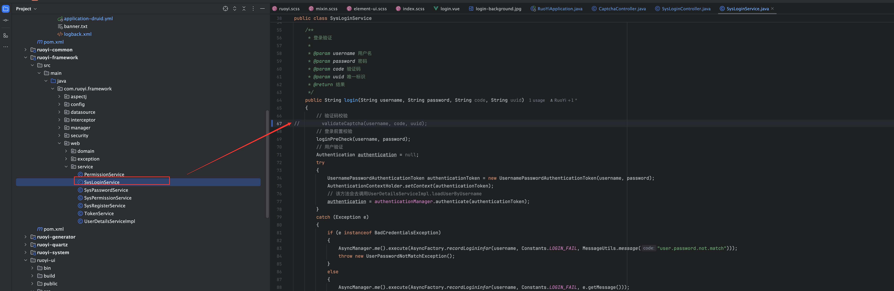

   注释掉，重新启动，就不会做验证码校验。

2. 然后分析一下返回结果

   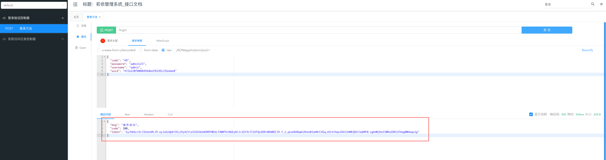

   只需要成功，拿到 token 就可以。

3. 想一些问题

   - token 存哪里，如何做持久化

     我们一般是将 token 存入到浏览器的 `Local storage`中的，当然也有放到浏览器的`Cookies`中的，我们这里将他放到 `Local storage`

     

   - 后面我们所有请求都是需要 token

     先给思路，我们只需要放到请求前置拦截器中，token 就从 `Local storage`中取就可以了，后面有具体实现步骤

4. 先发送请求，获取到 token

   创建`user.js`

   

   ```js
   // 用户相关的，登录、登出、注册、获取用户信息、修改用户信息
   import request from '@/utils/request.js'
   
   // 登录
   //请求参数 obj示例：{"code":"","password":"","username":"","uuid":""}
   export const login = (obj) => {
   	return request({
   		url: '/login',
   		method: "post",
   		data: obj
   	})
   }
   
   ```

   绑定到`login.vue`页面的`登录`按钮上

   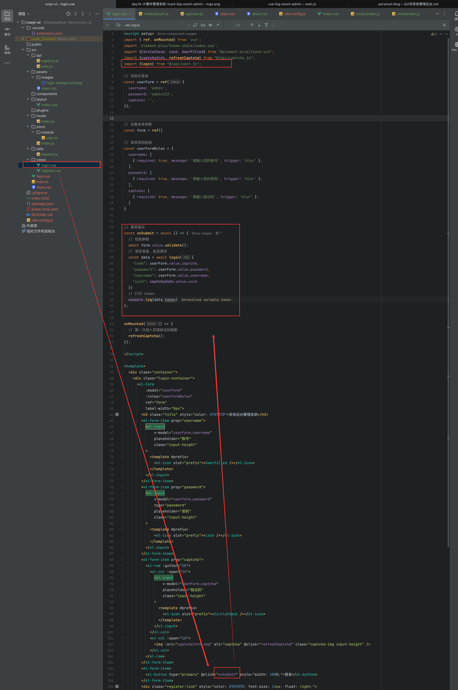

   ```js
   import {login} from "@/api/user.js";
   
   // 登录提交
   const onSubmit = async () => {
     // 校验参数
     await form.value.validate();
     // 请求准备、发送请求
     const data = await login({
       "code": userForm.value.captcha,
       "password": userForm.value.password,
       "username": userForm.value.username,
       "uuid": captchaInfo.value.uuid
     })
     // 打印 token
     console.log(data.token)
   };
   ```

5. `token`持久化

   我这里使用的 vue 配套的 `pinia`，`pinia`（pinia 官方文档）默认是默认保存到内存中的，也就是刷新页面，就会被清除；可以通过配置持久化到 `Local storage`。

   - 安装

     

     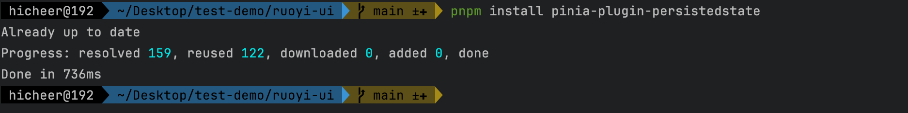

     ```bash
     pnpm install pinia
     pnpm install pinia-plugin-persistedstate
     ```

   - 引入（这里和上面有点区别，因为考虑到后续为了方便引入更多的插件）

     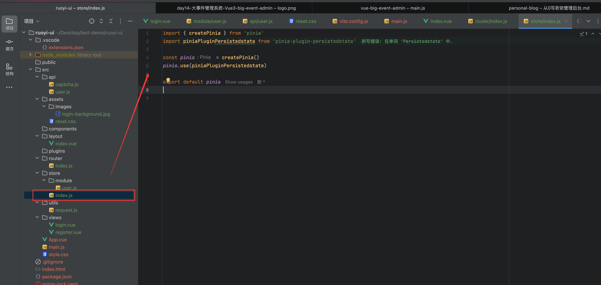

     ```js
     import { createPinia } from 'pinia'
     import piniaPluginPersistedstate from 'pinia-plugin-persistedstate'
     
     const pinia = createPinia()
     pinia.use(piniaPluginPersistedstate)
     
     export default pinia
     
     ```

     

     ```js
     import { createApp } from 'vue'
     import "./style.css"
     import 'element-plus/dist/index.css'
     
     import App from './App.vue'
     import router from "@/router/index.js";
     import pinia from "@/store/index.js";
     
     const app = createApp(App);
     
     // 添加路由 router
     app.use(router)
     
     // 添加 pinia
     app.use(pinia)
     
     // 挂载
     app.mount('#app')
     
     ```
     
- 创建`store`
  
  什么是`store`，根据官方文档上看，其实就是一个`实体对象`，里面定义唯一的标识`id`，类中的`参数`，操作参数的方法等
  
  首先创建文件`user.js`（根据自己模块块起这个文件名）
  
  
  
  ```js
     import { defineStore } from 'pinia'
     import { ref } from 'vue'
     
     export const tokenStore = defineStore(
       // store 唯一标识
       'token',
       // 对外暴露信息
       () => {
         // token 初始化
         const token = ref('')
         
         // 设置用户 token
         const setToken = (newToken) => {
           token.value = `Bearer ${newToken}`
         }
         
         // 移除用户 token
         const removeToken = () => {
           token.value = ''
         }
         
         // 对外提供 store 信息
         return {
           token,
           setToken,
           removeToken
         }
       },
       // 选项配置
       {
         persist: true // 持久化
       }
     )
  ```
  
  最后在`index.js`中统一导出
  
  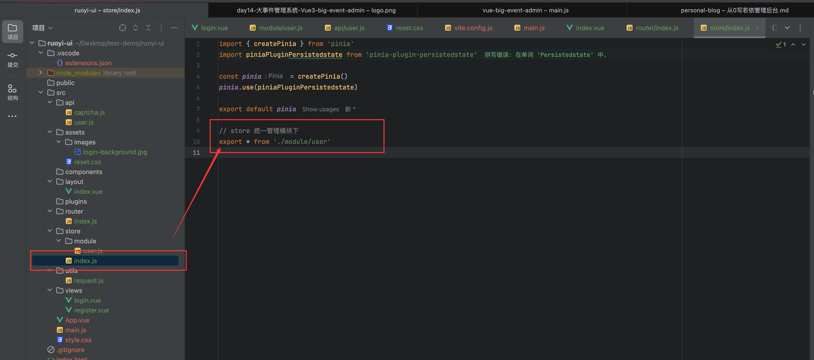
  
  ```js
     // store 统一管理模块下
     export * from './module/user'
  ```
  
- 将我们获取的`token`持久化
  
  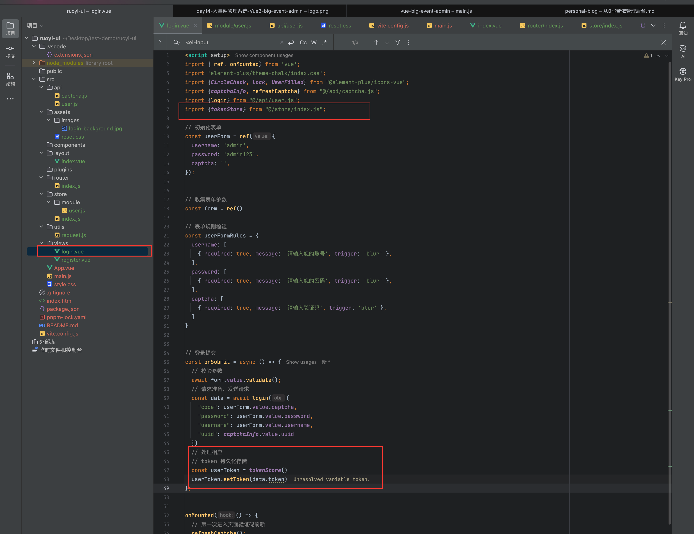
  
  ```js
     import {tokenStore} from "@/store/index.js";
     
     // token 持久化存储
     const userToken = tokenStore()
     userToken.setToken(data.token)
  ```
  
- 测试一下是否存入到了 `Local storage`
  
  
  
  OK 了
  
6. 在请求拦截器中统一在请求头中添加`token`
   
   
   
   ```js
      import {tokenStore} from "@/store/index.js";
      
      instance.interceptors.request.use(function (config) {
      	// 在发送请求之前做些什么
      	const userToken = tokenStore();
      	if (userToken.token !== '') {
      		config.headers.Authorization = userToken.token
      	}
      	return config;
      }, function (error) {
      	// 对请求错误做些什么
      	return Promise.reject(error);
      });
   ```
   
   测试一下是否请求中携带了`token`
   
   因为我们还没有接其他接口，我们可以点击刷新验证码，看看是否添加成功了。
   
   
   
   OK 了
   
7. 说明一下
   
   到这里基本的 vue 内容就就完成了，剩下应该是：
   
   - 封装通用组件（包括组件值传递）
      - 画页面（这样也是我的薄弱项）
   
   废话不多说，开始画页面；后面需要用到封装组件的，后面再说

### 页面布局

1. 清除默认的样式

   我们需要请求 vue 创建给我们的 css 样式、以及默认各种标签中自带的样式

   - 创建重置默认标签样式文件`reset.css`

     

     ```css
     /* CSS Reset */
     html, body, div, span, applet, object, h1, h2, h3, h4, h5, h6, p, blockquote, pre, a, abbr, acronym, address, big, cite, code, del, dfn, em, img, ins, kbd, q, s, samp, small, strike, strong, sub, sup, tt, var, b, u, i, center, dl, dt, dd, ol, ul, li, fieldset, form, label, legend, table, caption, tbody, tfoot, thead, tr, th, td, article, aside, canvas, details, embed, figure, figcaption, footer, header, hgroup, menu, nav, output, ruby, section, summary, time, mark, audio, video {
         margin: 0;
         padding: 0;
         border: 0;
         font-size: 100%;
         font: inherit;
         font-weight: normal;
         vertical-align: baseline;
     }
     
     /* HTML5 display-role reset for older browsers */
     article, aside, details, figcaption, figure, footer, header, hgroup, menu, nav, section {
         display: block;
     }
     
     ol, ul, li {
         list-style: none;
     }
     
     blockquote, q {
         quotes: none;
     }
     
     blockquote:before, blockquote:after, q:before, q:after {
         content: '';
         content: none;
     }
     
     table {
         border-collapse: collapse;
         border-spacing: 0;
     }
     
     th, td {
         vertical-align: middle;
     }
     
     /* Custom */
     a {
         outline: none;
         color: #16418a;
         text-decoration: none;
         -webkit-backface-visibility: hidden;
     }
     
     a:focus {
         outline: none;
     }
     
     input:focus, select:focus, textarea:focus {
         outline: -webkit-focus-ring-color auto 0;
     }
     
     /* Ensure html and body take up full height */
     html, body {
         height: 100%;
         margin: 0;
         padding: 0;
     }
     
     body {
         display: flex;
         flex-direction: column;
     }
     
     #app {
         flex: 1;
         display: flex;
         flex-direction: column;
     }
     
     ```

   - 引入`reset.css`,删除默认的`style.css`

     我们直接删掉`style.css`

     

     引入我们的`reset.css`

     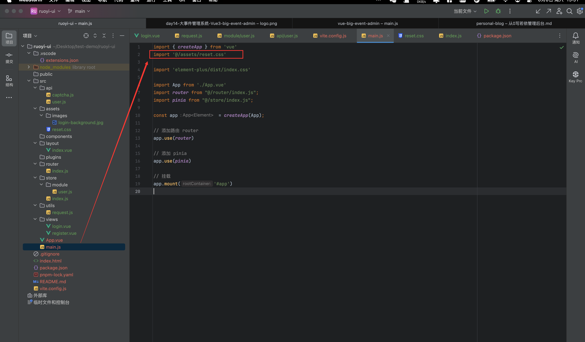
   
   - 验证是否成功
   
     我们看一下我们的 login 页面
   
     
   
     发现样式没有了，也不居中了；别慌，也就说明我们上面重置的步骤生效了，接下来头疼的来了，画页面。
   
     不会画页面咋办，那就真的没办法，只能chatgpt、chrome、百度；要不然系统的学一下 html、css 了，我这里就不系统介绍了，后面的就直接贴代码了，自己去挑样式了。
   

2. 登录页样式

   效果

   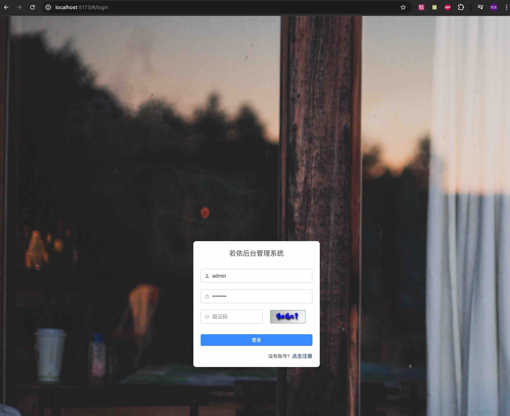

   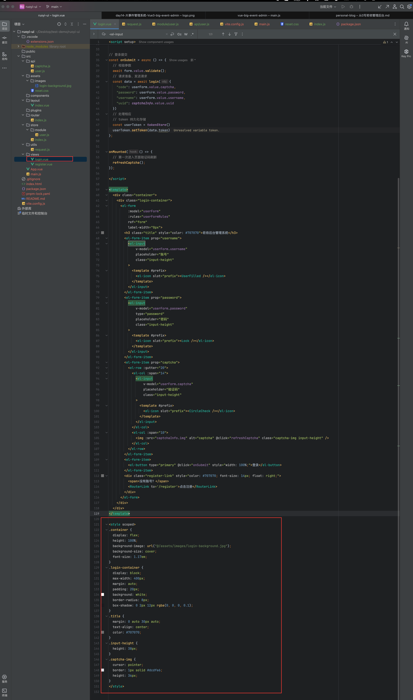

   ```css
   .container {
     display: flex;
     height: 100%;
     background-image: url("@/assets/images/login-background.jpg");
     background-size: cover;
     font-size: 1.17em;
   }
   .login-container {
     display: block;
     max-width: 400px;
     margin: auto;
     padding: 20px;
     background: white;
     border-radius: 8px;
     box-shadow: 0 2px 12px rgba(0, 0, 0, 0.1);
   }
   .title {
     margin: 0 auto 30px auto;
     text-align: center;
     color: #707070;
   }
   .input-height {
     height: 38px;
   }
   .captcha-img {
     cursor: pointer;
     border: 1px solid #dcdfe6;
     height: 36px;
   }
   ```

3. 主页

   - 分析

     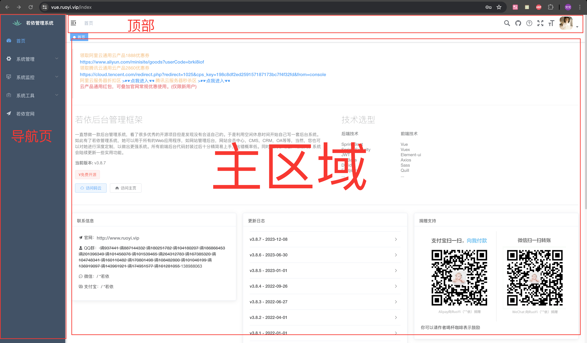

     也就分三个区域，从 <a herf='https://element-plus.org/zh-CN/component/container.html'>element-ui</a> 中选择类似布局

     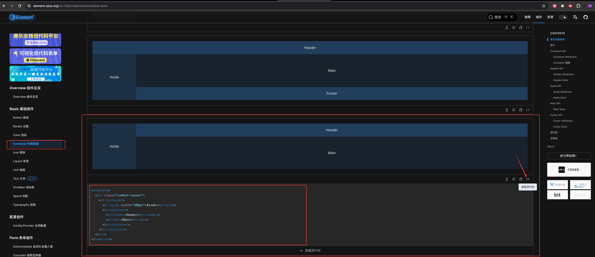

   - 实现

     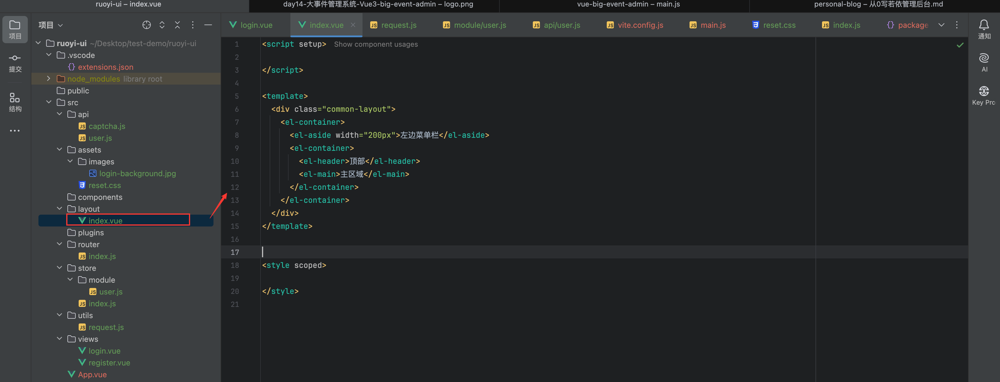

     ```vue
     <script setup>
     
     </script>
     
     <template>
       <div class="common-layout">
         <el-container>
           <el-aside width="200px">左边菜单栏</el-aside>
           <el-container>
             <el-header>顶部</el-header>
             <el-main>主区域</el-main>
           </el-container>
         </el-container>
       </div>
     </template>
     
     
     <style scoped>
     
     </style>
     
     ```

     配置`router`看一下效果

     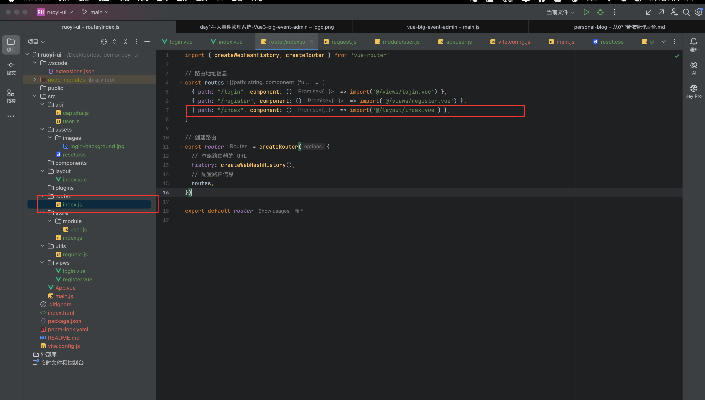

     ```js
     	{ path: "/index", component: () => import('@/layout/index.vue') },
     ```

     

     好像生效了，不明显，那就加个背景色

     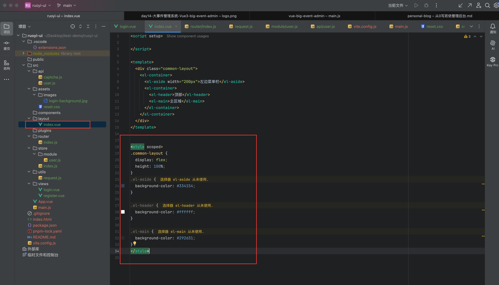

     ```css
     .common-layout {
       display: flex;
       height: 100%;
     }
     .el-aside {
       background-color: #334154;
     }
     
     .el-header {
       background-color: #ffffff;
     }
     
     .el-main {
       background-color: #292d31;
     }
     ```

     

     可以了。

4. 侧边导航样式优化

   - 菜单正常显示、并且菜单可以折叠

     首先我们分析一下样式结构

     

     在没有看 `ruoyi`代码之前，我觉得菜单分两个部分`上面的图标和若依管理系统`与`下面的菜单`,但是我这样理解之后发现了一个问题，也就是***菜单无法折叠***，因为菜单折叠是在element-ui的菜单组件中才有的；因此我将侧边栏整体看成一个部分，单独对第一个菜单项做单独处理。

     先看一下我们需要的组件

     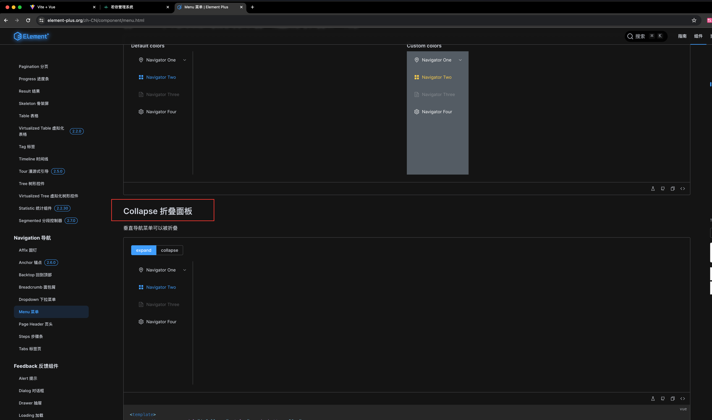

     官网代码如下

     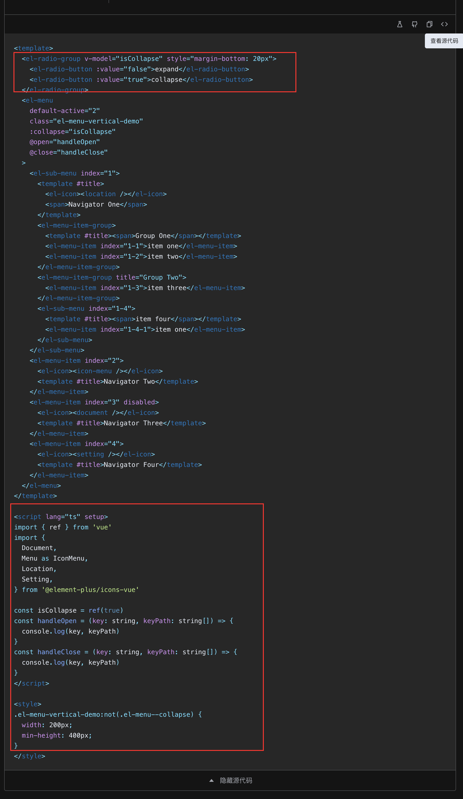

     我们可以看到`是否折叠`是根据`isCollapse`来判断的，我们触发`是否折叠`折叠的按钮是在另外一个页面，也就是`主页面顶部`，因此我们需要从另外一个页面触发侧边栏是否折叠。下面我直接给代码，你自己分析一下。

     `sidebar.vue`页面

     ```vue
     <template>
       <el-menu
           background-color="#304156"
           text-color="#85909f"
           default-active="1"
           class="sidebar-menu"
           :collapse="isCollapse"
           router
       >
         <!--顶部系统信息-->
         <el-menu-item index="/index" style="height: 56px; padding: 0 20px;">
           
           <span style="font-size: 14px; color: #ffffff">
                 若依管理系统
             </span>
         </el-menu-item>
         <!--首页-->
         <el-menu-item index="/index">
           <el-icon>
             <HomeFilled/>
           </el-icon>
           <span>首页</span>
         </el-menu-item>
         <!--系统管理-->
         <el-sub-menu index="/system">
           <template #title>
             <el-icon>
               <Setting/>
             </el-icon>
             <span>系统管理</span>
           </template>
           <el-menu-item index="/system/user">
             <el-icon>
               <User/>
             </el-icon>
             <span>用户管理</span></el-menu-item>
           <el-menu-item index="/system/role">
             <el-icon>
               <UserFilled/>
             </el-icon>
             <span>角色管理</span></el-menu-item>
           <el-menu-item index="2-3">
             <el-icon>
               <Menu/>
             </el-icon>
             <span>菜单管理</span></el-menu-item>
           <el-menu-item index="2-4">
             <el-icon>
               <Share/>
             </el-icon>
             <span>部门管理</span></el-menu-item>
           <el-menu-item index="2-5">
             <el-icon>
               <CirclePlusFilled/>
             </el-icon>
             <span>岗位管理</span></el-menu-item>
           <el-menu-item index="2-6">
             <el-icon>
               <Notebook/>
             </el-icon>
             <span>字典管理</span></el-menu-item>
           <el-menu-item index="2-7">
             <el-icon>
               <Document/>
             </el-icon>
             <span>参数设置</span></el-menu-item>
           <el-menu-item index="2-8">
             <el-icon>
               <ChatDotRound/>
             </el-icon>
             <span>通知公告</span></el-menu-item>
           <el-sub-menu index="2-9">
             <template #title>
               <el-icon>
                 <Tickets/>
               </el-icon>
               <span>日志管理</span></template>
             <el-menu-item index="2-9-1">
               <el-icon>
                 <Memo/>
               </el-icon>
               <span>操作日志</span></el-menu-item>
             <el-menu-item index="2-9-2">
               <el-icon>
                 <DataLine/>
               </el-icon>
               <span>登录日志</span></el-menu-item>
           </el-sub-menu>
         </el-sub-menu>
       <!--系统监控-->
       <el-sub-menu index="3">
         <template #title>
           <el-icon><Monitor /></el-icon>
           <span>系统监控</span>
         </template>
         <el-menu-item index="3-1">
           <el-icon><DataLine /></el-icon>
           <span>在线用户</span></el-menu-item>
         <el-menu-item index="3-2">
           <el-icon><Postcard /></el-icon>
           <span>定时任务</span></el-menu-item>
         <el-menu-item index="3-3">
           <el-icon><TrendCharts /></el-icon>
           <span>数据监控</span></el-menu-item>
         <el-menu-item index="3-4">
           <el-icon>
             <Share/>
           </el-icon>
           <span>缓存监控</span></el-menu-item>
         <el-menu-item index="3-5">
           <el-icon>
             <CirclePlusFilled/>
           </el-icon>
           <span>缓存列表</span></el-menu-item>
       </el-sub-menu>
       </el-menu>
     </template>
     
     <script lang="ts" setup>
     import {
       Document,
       Setting,
       HomeFilled,
       User,
       UserFilled,
       Share,
       CirclePlusFilled,
       Notebook,
       ChatDotRound,
       Tickets,
       Memo,
       DataLine,
       Menu, Monitor, Postcard, TrendCharts,
     } from '@element-plus/icons-vue'
     import { defineProps } from 'vue';
     
     // 是否菜单塌陷 true：塌陷，false：不塌陷
     const props = defineProps({
       isCollapse: {
         type: Boolean,
         required: true
       }
     })
     
     </script>
     
     <style lang="scss">
     .el-menu-vertical-demo:not(.el-menu--collapse) {
       width: 200px;
       min-height: 400px;
     }
     .sidebar-menu {
       height: 100%;
       border: 0;
     }
     span {
       font-size: 13px;
     }
     .logo-container {
       display: flex;
       width: 100%;
       height: 50px;
       align-items: center;
       justify-content: center;
     }
     
     .logo-container img {
       width: 32px;
       height: 32px;
       margin-right: 12px;
     }
     </style>
     
     ```

     这里我先配置前几个页面的跳转链接，方便后面测试。

     `index.vue`主页面

     

     ```vue
     <script setup>
     
     import Sidebar from "@/layout/sidebar.vue";
     import {DArrowRight} from "@element-plus/icons-vue";
     import { ref } from 'vue';
     import {useRoute} from "vue-router";
     
     const isCollapse = ref(false);
     
     const menuFold = async () => {
       isCollapse.value = !isCollapse.value
     }
     const route = useRoute();
     
     console.log(route)
     </script>
     
     <template>
       <div class="common-layout">
         <el-container>
           <div class="sidebar-container">
             <sidebar :is-collapse="isCollapse"/>
           </div>
           <el-container>
             <el-header>
               <div class="menu-fold" @click="menuFold">
                 <el-icon color="#737d8e" size="30"><DArrowRight /></el-icon>
               </div>
             </el-header>
             <el-main>主区域</el-main>
           </el-container>
         </el-container>
       </div>
     </template>
     
     
     <style scoped lang="scss">
     @import '@/assets/styles/variables.scss';
     
     .common-layout {
       display: flex;
       height: 100%;
     }
     
     .sidebar-container {
       height: 100%;
       background-color: #3A71A8;
     
     }
     .el-header {
       display: flex;
       background-color: #ffffff;
       height:50px;
       padding: 0;
     }
     .menu-fold {
       height: 30px;
       width: 30px;
       cursor: pointer;
       text-align: center;
       line-height: 50px;
       padding: 10px;
     }
     .menu-fold-other {
       width: 100%;
     }
     .breadcrumb {
       display: flex;
       height: 100%;
       align-items: center;
       font-size: 16px;
     }
     .breadcrumb-font {
       font-size: 16px;
     }
     .crumb {
       height: 56px;
     }
     
     .el-main {
       background-color: #292d31;
     }
     </style>
     
     ```

     效果

     

   - 进一步优化（页面顶部需要菜单路径）

     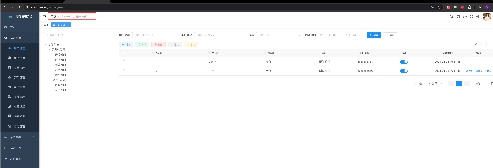

     这里我们需要做两点：1、菜单绑定路由（确定点击菜单可以跳转正确的页面），2、点击菜单在主页面可以获取路由信息（这样才可渲染菜单路径）

     菜单绑定路由（调整路由页面）：

     

     ```js
     {
     		path: "/",
     		redirect: '/index',
     		meta: {title: '首页'},
     		children: [
     			{
     				path: "index",
     				component: () => import('@/layout/index.vue'),
     			},
     			{
     				path: "system",
     				meta:  {title: '系统管理'},
     				children: [
     					{
     						path: "user",
     						component: () => import('@/layout/user.vue'),
     						meta:  {title: '用户管理'},
     					},
     					{
     						path: "role",
     						component: () => import('@/layout/index.vue'),
     						meta:  {title: '角色管理'},
     					},
     				]
     			},
     		]
     	},
     ```

     注意一下：我这样配置路由是有问题的，在`path:"/"`这里并没有配置`component`，在点击`用户管理`的时候就会导致直接在一个新的新页面打开了 user 页面，因此我们需要调整一下

     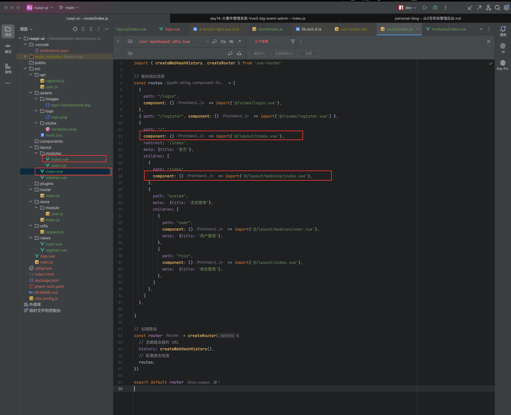

     ```js
     import { createWebHashHistory, createRouter } from 'vue-router'
     
     // 路由地址信息
     const routes = [
     	{
     		path: "/login",
     		component: () => import('@/views/login.vue'),
     	},
     	{ path: "/register", component: () => import('@/views/register.vue') },
     	{
     		path: "/",
     		component: () => import('@/layout/index.vue'),
     		redirect: '/index',
     		meta: {title: '首页'},
     		children: [
     			{
     				path: "index",
     				component: () => import('@/layout/modules/index.vue'),
     			},
     			{
     				path: "system",
     				meta:  {title: '系统管理'},
     				children: [
     					{
     						path: "user",
     						component: () => import('@/layout/modules/user.vue'),
     						meta:  {title: '用户管理'},
     					},
     					{
     						path: "role",
     						component: () => import('@/layout/index.vue'),
     						meta:  {title: '角色管理'},
     					},
     				]
     			},
     		]
     	},
     
     ]
     
     // 创建路由
     const router = createRouter({
     	// 忽略路由器的 URL
     	history: createWebHashHistory(),
     	// 配置路由信息
     	routes,
     })
     
     export default router
     
     ```

     我们调整一下主页面

     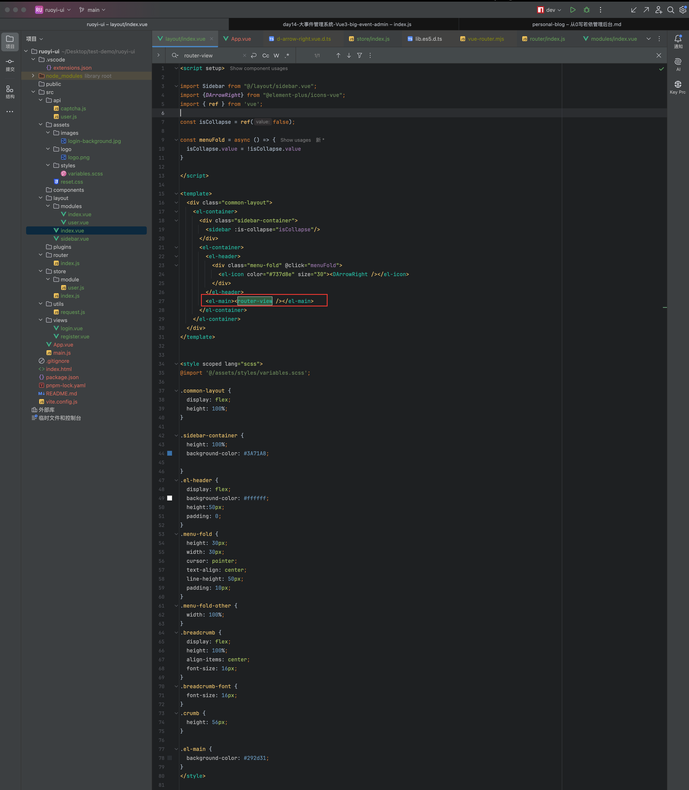

     这样就可以正确显示，效果

     

5. 路由菜单优化

   > 为什么要做优化呢？
   >
   > 因为我发现关于`菜单的名称`在两个地方`router/index.js`和`layout.sidebar.vue`都存在；同样的菜单名称，配置两个地方相对来说，调整起来不是很方便，不容易维护，那我们就调整一下。
   >
   > 思路：在`router/index.js`配置完，`layout.sidebar.vue`去获取这些菜单，自动生成`树形结构的菜单`。

   - 首先，路由定义

     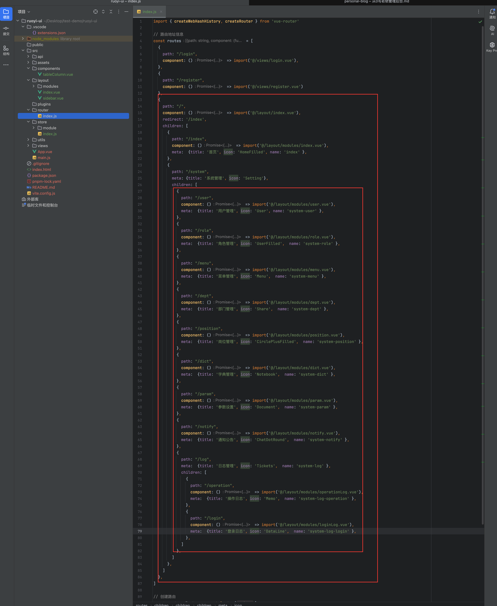

     ```js
     import { createWebHashHistory, createRouter } from 'vue-router'
     
     // 路由地址信息
     const routes = [
     	{
     		path: "/login",
     		component: () => import('@/views/login.vue'),
     	},
     	{
     		path: "/register",
     		component: () => import('@/views/register.vue')
     	},
     	{
     		path: "/",
     		component: () => import('@/layout/index.vue'),
     		redirect: '/index',
     		children: [
     			{
     				path: "/index",
     				component: () => import('@/layout/modules/index.vue'),
     				meta:  {title: '首页', icon: 'HomeFilled', name: 'index' },
     			},
     			{
     				path: "/system",
     				meta: {title: '系统管理', icon: 'Setting'},
     				children: [
     					{
     						path: "/user",
     						component: () => import('@/layout/modules/user.vue'),
     						meta:  {title: '用户管理', icon: 'User', name: 'system-user' },
     					},
     					{
     						path: "/role",
     						component: () => import('@/layout/modules/role.vue'),
     						meta:  {title: '角色管理', icon: 'UserFilled',  name: 'system-role' },
     					},
     					{
     						path: "/menu",
     						component: () => import('@/layout/modules/menu.vue'),
     						meta:  {title: '菜单管理', icon: 'Menu',  name: 'system-menu' },
     					},
     					{
     						path: "/dept",
     						component: () => import('@/layout/modules/dept.vue'),
     						meta:  {title: '部门管理', icon: 'Share',  name: 'system-dept' },
     					},
     					{
     						path: "/position",
     						component: () => import('@/layout/modules/position.vue'),
     						meta:  {title: '岗位管理', icon: 'CirclePlusFilled',  name: 'system-position' },
     					},
     					{
     						path: "/dict",
     						component: () => import('@/layout/modules/dict.vue'),
     						meta:  {title: '字典管理', icon: 'Notebook',  name: 'system-dict' },
     					},
     					{
     						path: "/param",
     						component: () => import('@/layout/modules/param.vue'),
     						meta:  {title: '参数设置', icon: 'Document',  name: 'system-param' },
     					},
     					{
     						path: "/notify",
     						component: () => import('@/layout/modules/notify.vue'),
     						meta:  {title: '通知公告', icon: 'ChatDotRound',  name: 'system-notify' },
     					},
     					{
     						path: "/log",
     						meta:  {title: '日志管理', icon: 'Tickets',  name: 'system-log' },
     						children: [
     							{
     								path: "/operation",
     								component: () => import('@/layout/modules/operationLog.vue'),
     								meta:  {title: '操作日志', icon: 'Memo',  name: 'system-log-operation' },
     							},
     							{
     								path: "/login",
     								component: () => import('@/layout/modules/loginLog.vue'),
     								meta:  {title: '登录日志', icon: 'DataLine',  name: 'system-log-login' },
     							},
     						]
     					},
     				]
     			},
     		]
     	},
     ]
     
     // 创建路由
     const router = createRouter({
     	// 忽略路由器的 URL
     	history: createWebHashHistory(),
     	// 配置路由信息
     	routes,
     })
     
     export default router
     
     ```

     我们需要注意一下每个菜单配置都有一个`meta`字段，里面有三个参数`title：菜单名称`、`icon：菜单图标`和`name：页面名称`

   - 然后，关键创建一下这些新的页面

     

   - 最后，调整菜单页面了`sidebar.vue`

     ⚠️注意页面是调整最大的，先上代码，然后解释

     ```vue
     <template>
       <el-menu
           background-color="#304156"
           text-color="#85909f"
           :default-active="activeIndex"
           class="sidebar-menu"
           :collapse="isCollapse"
           :router="true"
           @select="handleMenuItemSelect"
       >
         <!-- 顶部系统信息 -->
         <el-menu-item index="/index" style="height: 56px; padding: 0 20px;">
           
           <span style="font-size: 14px; color: #ffffff">
             若依管理系统
           </span>
         </el-menu-item>
     
         <!-- 菜单项 -->
         <template v-for="item in mainMenuItems" :key="item.index">
           <el-menu-item v-if="!item.children" :index="item.index">
             <el-icon>
               <component :is="getIconComponent(item.icon)" />
             </el-icon>
             <span>{{ item.title }}</span>
           </el-menu-item>
           <el-sub-menu v-else :index="item.index">
             <template #title>
               <el-icon>
                 <component :is="getIconComponent(item.icon)" />
               </el-icon>
               <span>{{ item.title }}</span>
             </template>
             <template v-for="subItem in item.children" :key="subItem.index">
               <el-menu-item v-if="!subItem.children" :index="subItem.index">
                 <el-icon>
                   <component :is="getIconComponent(subItem.icon)" />
                 </el-icon>
                 <span>{{ subItem.title }}</span>
               </el-menu-item>
               <el-sub-menu v-else :index="subItem.index">
                 <template #title>
                   <el-icon>
                     <component :is="getIconComponent(subItem.icon)" />
                   </el-icon>
                   <span>{{ subItem.title }}</span>
                 </template>
                 <template v-for="sonItem in subItem.children" :key="sonItem.index">
                   <el-menu-item v-if="!sonItem.children" :index="sonItem.index">
                     <el-icon>
                       <component :is="getIconComponent(sonItem.icon)" />
                     </el-icon>
                     <span>{{ sonItem.title }}</span>
                   </el-menu-item>
                 </template>
               </el-sub-menu>
             </template>
           </el-sub-menu>
         </template>
       </el-menu>
     </template>
     
     <script lang="ts" setup>
     import * as Icons from '@element-plus/icons-vue';
     import { defineProps } from 'vue';
     import { useRouter } from 'vue-router';
     
     // 获取全部路由
     const router = useRouter();
     
     // 路由转菜单
     const generateMenuItems = (routers) => {
       return routers.map(route => {
         const menuItem = {
           index: route.path,
           title: route.meta?.title || '',
           icon: route.meta?.icon || '',
           name: route.meta?.name || '',
           children: route.children ? generateMenuItems(route.children) : null
         };
         return menuItem;
       });
     };
     
     const menuItems = generateMenuItems(router.options.routes);
     // 获取主要菜单
     const mainMenuItems = menuItems.find(item => item.index === '/')?.children || [];
     
     // 是否菜单塌陷 true：塌陷，false：不塌陷
     const props = defineProps({
       isCollapse: {
         type: Boolean,
         required: true
       },
       activeIndex: {
         type: String,
         required: true
       }
     });
     </script>
     
     <style lang="scss">
     .el-menu-vertical-demo:not(.el-menu--collapse) {
       width: 200px;
       min-height: 400px;
     }
     .sidebar-menu {
       height: 100%;
       border: 0;
     }
     span {
       font-size: 13px;
     }
     .logo-container {
       display: flex;
       width: 100%;
       height: 50px;
       align-items: center;
       justify-content: center;
     }
     
     .logo-container img {
       width: 32px;
       height: 32px;
       margin-right: 12px;
     }
     </style>
     
     ```

     1. 获取全部的路由，然后从路由中提取出菜单信息，这个菜单信息是有层级结构的（警告不影响，这里就忽略了）

     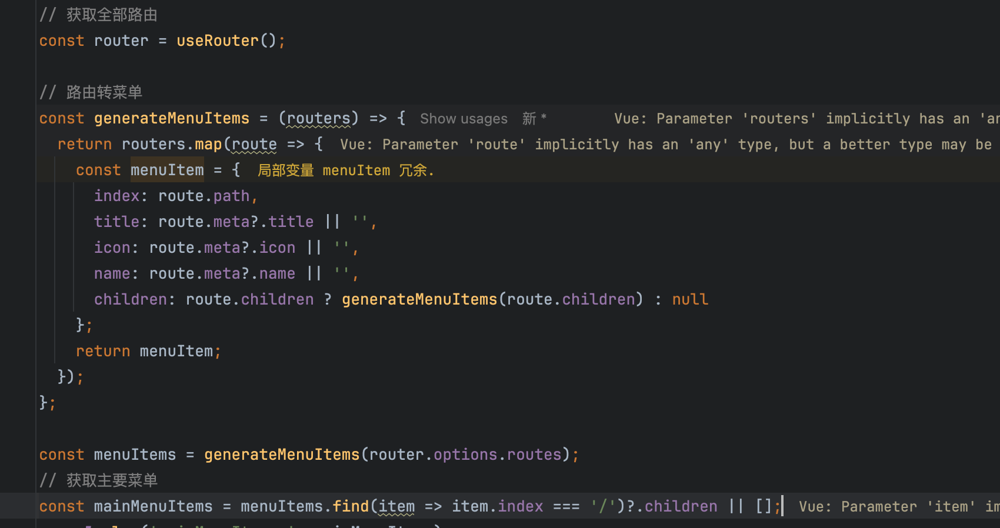

     `mainMenuItems`的具体结构如下

     ``` json
     [
         {
             "index": "/index",
             "title": "首页",
             "icon": "HomeFilled",
             "name": "index",
             "children": null
         },
         {
             "index": "/system",
             "title": "系统管理",
             "icon": "Setting",
             "name": "",
             "children": [
                 {
                     "index": "/user",
                     "title": "用户管理",
                     "icon": "User",
                     "name": "system-user",
                     "children": null
                 },
                 {
                     "index": "/role",
                     "title": "角色管理",
                     "icon": "UserFilled",
                     "name": "system-role",
                     "children": null
                 },
                 {
                     "index": "/menu",
                     "title": "菜单管理",
                     "icon": "Menu",
                     "name": "system-menu",
                     "children": null
                 },
                 {
                     "index": "/dept",
                     "title": "部门管理",
                     "icon": "Share",
                     "name": "system-dept",
                     "children": null
                 },
                 {
                     "index": "/position",
                     "title": "岗位管理",
                     "icon": "CirclePlusFilled",
                     "name": "system-position",
                     "children": null
                 },
                 {
                     "index": "/dict",
                     "title": "字典管理",
                     "icon": "Notebook",
                     "name": "system-dict",
                     "children": null
                 },
                 {
                     "index": "/param",
                     "title": "参数设置",
                     "icon": "Document",
                     "name": "system-param",
                     "children": null
                 },
                 {
                     "index": "/notify",
                     "title": "通知公告",
                     "icon": "ChatDotRound",
                     "name": "system-notify",
                     "children": null
                 },
                 {
                     "index": "/log",
                     "title": "日志管理",
                     "icon": "Tickets",
                     "name": "system-log",
                     "children": [
                         {
                             "index": "/operation",
                             "title": "操作日志",
                             "icon": "Memo",
                             "name": "system-log-operation",
                             "children": null
                         },
                         {
                             "index": "/login",
                             "title": "登录日志",
                             "icon": "DataLine",
                             "name": "system-log-login",
                             "children": null
                         }
                     ]
                 }
             ]
         }
     ]
     ```

     2. 改造页面，将`mainMenuItems`的数据渲染上去

     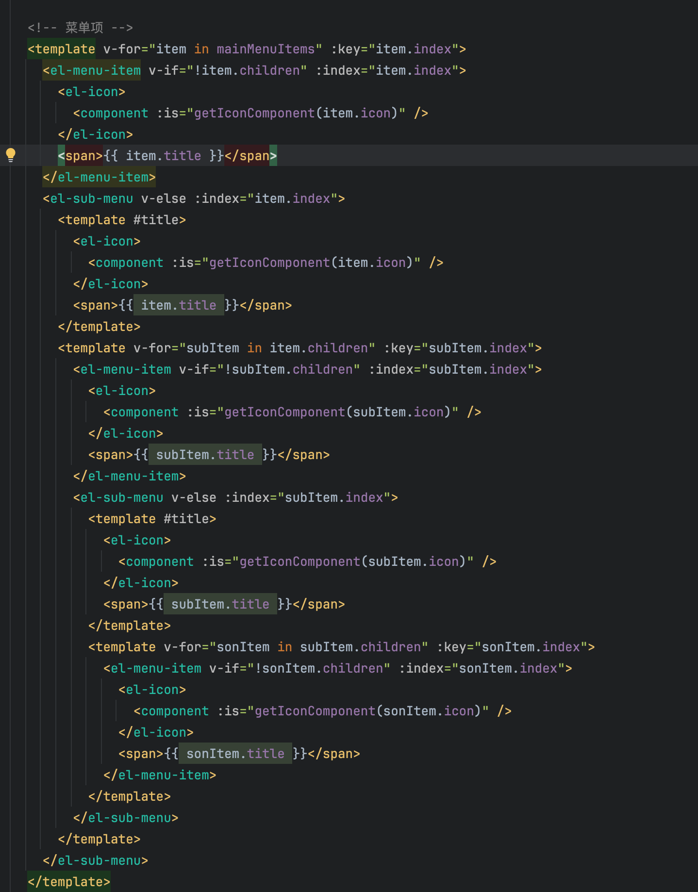

     里面有个方法`getIconComponent`是获取图标的，如果我们直接将图标的字符串放上是不生效的。

     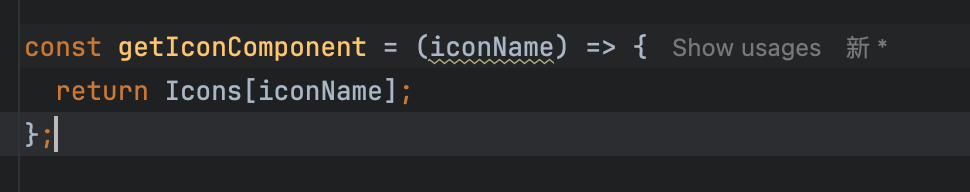

     ⚠️注意：我这里一开始的时候是确定了菜单只有`三层`，所以这里的代码适用于`小于等于3层`；如果你的`大于三层`，只需要在最后一层中自己接着`套娃`.

     3. 菜单路径

     

     ```vue
     <div class="menu-fold-other">
       <!-- 面包屑 -->
       <div class="breadcrumb">
         <el-breadcrumb separator="/">
           <el-breadcrumb-item v-for="(item, index) in route.matched" :key="index">
             {{ item.meta.title }}
           </el-breadcrumb-item>
         </el-breadcrumb>
       </div>
     </div>
     <script setup>
     import { useRoute, useRouter } from "vue-router";
     const route = useRoute();
     </script>
     ```

     OK，完成

     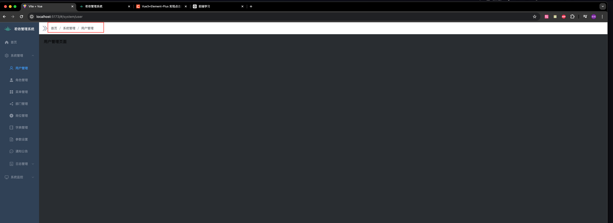

     4. 顶部标签页

     > 细节说明一下：
     >
     > 1. 点击`新的`菜单才会出现，重复点击不会再创建信息的
     > 2. `首页`是固定的第一个，不可以删除
     > 3. 有多个标签页面被打开，强制刷新页面时，其他页面会被关闭，当前页面会被保留
     > 4. 鼠标点击标签页面，菜单会切换到对应的菜，当选中的标签页的菜单处于折叠状态，会帮你打开折叠定位到对应的菜单

     

     这里是 <a herf='https://element-plus.org/zh-CN/component/tabs.html#tabs-%E6%A0%87%E7%AD%BE%E9%A1%B5'>element-ui-标签页</a> 对应的标签页

     具体代码

     

     ```vue
     <div>
       <el-tabs
                v-model="editableTabsValue"
                type="card"
                class="demo-tabs"
                @tab-remove="removeTab"
                @tab-click="tabClick"
                >
         <el-tab-pane
                      v-for="item in editableTabs"
                      :closable="item.closable"
                      :key="item.name"
                      :label="item.title"
                      :name="item.name"
                      >
         </el-tab-pane>
       </el-tabs>
     </div>
     ```

     这里面的方法如下：

     

     ```vue
     <script setup>
     import Sidebar from "@/layout/sidebar.vue";
     import { DArrowRight } from "@element-plus/icons-vue";
     import { ref, watch } from 'vue';
     import { useRoute, useRouter } from "vue-router";
     
     // 获取全部路由
     const router = useRouter();
     // 获取当前路由
     const route = useRoute();
     
     // 初始化菜单是否折叠
     const isCollapse = ref(false);
     
     // 菜单是否折叠切换
     const menuFold = async () => {
       isCollapse.value = !isCollapse.value;
     };
     
     // 初始化标签页定位
     const editableTabsValue = ref('index');
     // 初始化标签页
     const editableTabs = ref([
       {
         title: '首页',
         name: 'index',
         path: '/index',
         closable: false
       },
     ]);
     
     // 当前选中的菜单项
     const activeIndex = ref(router.currentRoute.value.path);
     
     // 标签页点击跳转
     const tabClick = (event) => {
       const tabs = editableTabs.value;
       const tab = tabs.find(tab => tab.name === event.props.name);
       if (tab) {
         router.push(tab.path);
         activeIndex.value = tab.path; // 更新菜单选中项
       }
     };
     
     // 添加标签页
     const addTab = (obj) => {
       let existingTab = editableTabs.value.find(tab => tab.path === obj.path);
       if (!existingTab) {
         editableTabs.value.push({
           title: obj.title,
           name: obj.name,
           path: obj.path,
           closable: true
         });
         console.log(obj)
         console.log(editableTabs.value.name)
         editableTabsValue.value = obj.name;
         router.push(obj.path);
       } else {
         editableTabsValue.value = existingTab.name;
         router.push(existingTab.path);
       }
       activeIndex.value = obj.path; // 更新菜单选中项
     };
     
     // 移除标签页
     const removeTab = (targetName) => {
       const tabs = editableTabs.value;
       let activeName = editableTabsValue.value;
       if (activeName === targetName) {
         tabs.forEach((tab, index) => {
           if (tab.name === targetName) {
             const nextTab = tabs[index + 1] || tabs[index - 1];
             if (nextTab) {
               activeName = nextTab.name;
               router.push(nextTab.path);
             }
           }
         });
       }
       editableTabsValue.value = activeName;
       editableTabs.value = tabs.filter((tab) => tab.name !== targetName);
       activeIndex.value = editableTabs.value.find(tab => tab.name === activeName)?.path || '/index'; // 更新菜单选中项
     };
     
     // 点击菜单添加标签页
     const handleMenuItemClick = (menuItem) => {
       addTab({
         title: menuItem.title,
         path: menuItem.index,
         name: menuItem.name
       });
     };
     
     // 页面加载时根据路径恢复标签页
     watch(route, () => {
       const currentPath = route.path;
       const existingTab = editableTabs.value.find(tab => tab.path === currentPath);
       if (!existingTab) {
         // 如果不存在当前路径对应的标签页，添加新标签页
         addTab({
           title: route.meta.title || '新标签页', // 根据实际需要设置标签页标题
           path: currentPath,
           name: currentPath
         });
       } else {
         // 如果存在，激活该标签页
         editableTabsValue.value = existingTab.name;
       }
       activeIndex.value = currentPath; // 更新菜单选中项
     }, {immediate: true});
     </script>
     ```

     ⚠️注意一下，我们需要点击标签页，反向选中菜单，因此我们需要告诉菜单页面的我们当前选中是哪个页面

     在`layout/index.vue`中有一行代码，是用来获取当前页面的路径信息

     ```js
     // 当前选中的菜单项
     const activeIndex = ref(router.currentRoute.value.path);
     ```

     然后将这个参数传递给`sidebar.vue`页面

     

     `sidebar.vue`页面接收一下参数

     

     页面上加上这个参数就可以了

     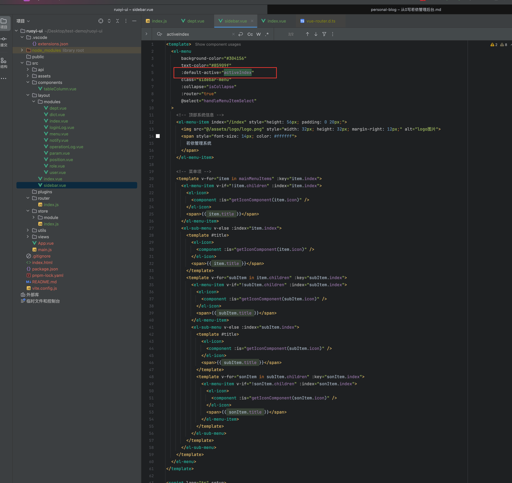

     效果

     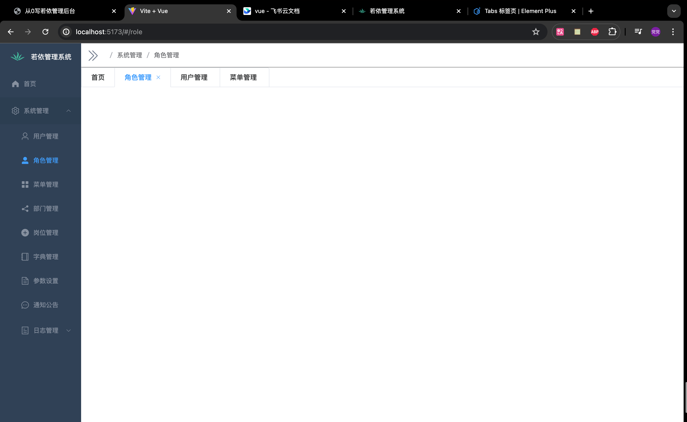

### 用户管理页面

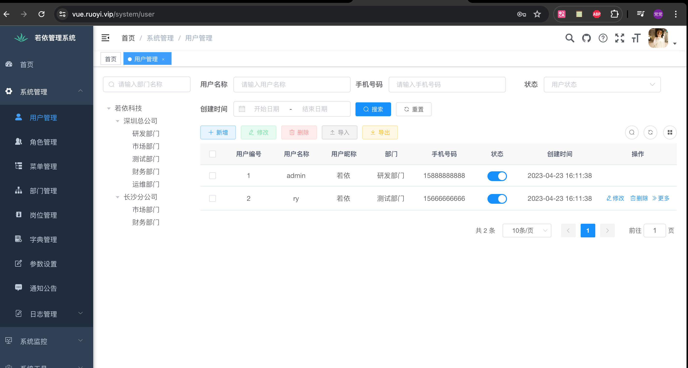

> 我会做那些内容？
>
> 1. 左边区域部门列表树，上面的搜索框可以做查询
> 2. 右边，上面的筛选框，包括`用户名称`、`手机号码`、`状态`、`创建时间`
> 3. `增删改查导出`按钮不做，但是哪一行中最后边的`隐藏/展示列表列`按钮会做
> 4. 简单的列表会做

最终的简易效果

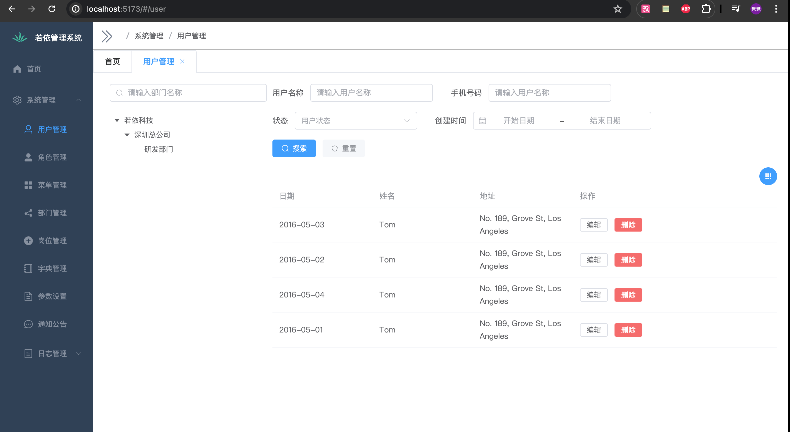

1. 左右布局

   使用 <a herf='https://element-plus.org/zh-CN/component/layout.html'>element-ui-布局</a> 

   

   调整一下左右的宽度，通过`:span`参数，注意`element-ui`的布局将一行拆成了24分，自己写的时候注意一下

   

   ```vue
   <script setup>
   </script>
   
   <template>
     <el-row>
       <el-col :span="6" style="padding: 0 10px; min-width: 100px" class="user-left">
       </el-col>
       <el-col :span="18" class="user-right">
       </el-col>
     </el-row>
   </template>
   
   <style scoped lang="scss">
   .user-left {
     height: 100px;
     background-color: #3A71A8;
   }
   .user-right {
     height: 100px;
     background-color: red;
   }
   </style>
   ```

   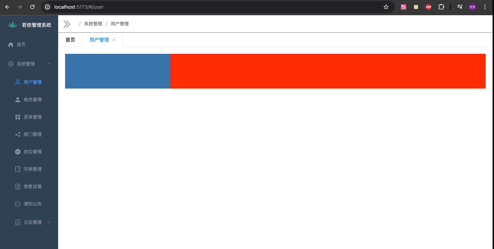

2. 左边部门

   效果

   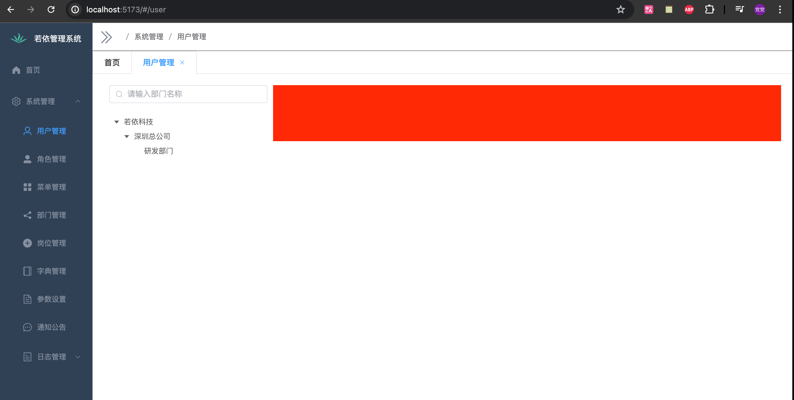

   ```vue
   <script setup>
   import {  Search, } from '@element-plus/icons-vue'
   import { ref, watch, reactive } from 'vue'
   import { ElTree } from 'element-plus'
   
   const filterText = ref('')
   const treeRef = ref()
   
   const defaultProps = {
     children: 'children',
     label: 'label',
   }
   
   watch(filterText, (val) => {
     treeRef.value.filter(val)
   })
   
   const filterNode = (value, data) => {
     if (!value) return true
     return data.label.includes(value)
   }
   
   const dept_data = [
     {
       label: '若依科技',
       children: [
         {
           label: '深圳总公司',
           children: [
             {
               label: '研发部门',
             },
           ],
         },
       ],
     }
   ]
   
   </script>
   
   <template>
     <el-row>
       <el-col :span="6" style="padding: 0 10px; min-width: 100px">
         <el-input
             v-model="filterText"
             style="width: 100%; margin-bottom: 20px;"
             placeholder="请输入部门名称"
         >
           <template #prefix>
             <el-icon class="el-input__icon"><search /></el-icon>
           </template>
         </el-input>
         <el-tree
             ref="treeRef"
             style="max-width: 600px;"
             class="filter-tree"
             :data="dept_data"
             :props="defaultProps"
             default-expand-all
             :filter-node-method="filterNode"
             empty-text="暂无数据"
         />
       </el-col>
     </el-row>
   </template>
   
   <style scoped lang="scss">
   
   .user-right {
     height: 100px;
     background-color: red;
   }
   </style>
   
   ```

3. 右边筛选

   效果

   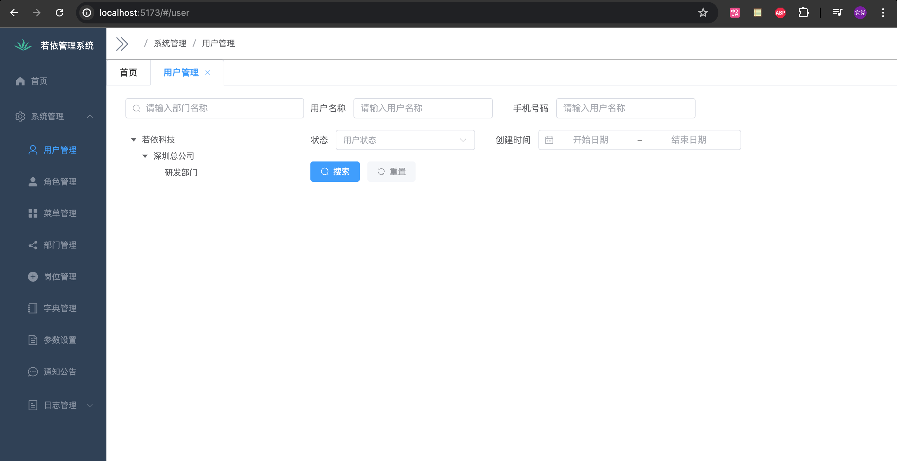

   ```vue
   <script setup>
   import { Refresh, Search, } from '@element-plus/icons-vue'
   import { ref, watch, reactive } from 'vue'
   import { ElTree } from 'element-plus'
   
   const filterText = ref('')
   const treeRef = ref()
   
   const defaultProps = {
     children: 'children',
     label: 'label',
   }
   
   watch(filterText, (val) => {
     treeRef.value.filter(val)
   })
   
   const filterNode = (value, data) => {
     if (!value) return true
     return data.label.includes(value)
   }
   
   const dept_data = [
     {
       label: '若依科技',
       children: [
         {
           label: '深圳总公司',
           children: [
             {
               label: '研发部门',
             },
           ],
         },
       ],
     }
   ]
   
   // 右边
   
   const formInline = reactive({
     user: '',
     region: '',
     date: '',
   })
   
   const onSubmit = () => {
     console.log('submit!')
   }
   
   const refresh = () => {
     console.log('refresh!')
   }
   </script>
   
   <template>
     <el-row>
       <el-col :span="6" style="padding: 0 10px; min-width: 100px">
         <el-input
             v-model="filterText"
             style="width: 100%; margin-bottom: 20px;"
             placeholder="请输入部门名称"
         >
           <template #prefix>
             <el-icon class="el-input__icon"><search /></el-icon>
           </template>
         </el-input>
         <el-tree
             ref="treeRef"
             style="max-width: 600px;"
             class="filter-tree"
             :data="dept_data"
             :props="defaultProps"
             default-expand-all
             :filter-node-method="filterNode"
             empty-text="暂无数据"
         />
       </el-col>
       <el-col :span="18" class="user-right">
         <div>
           <el-form :inline="true" :model="formInline" class="demo-form-inline">
             <el-form-item label="用户名称">
               <el-input v-model="formInline.user" placeholder="请输入用户名称" clearable />
             </el-form-item>
             <el-form-item label="手机号码">
               <el-input v-model="formInline.user" placeholder="请输入用户名称" clearable />
             </el-form-item>
             <el-form-item label="状态">
               <el-select v-model="formInline.region" placeholder="用户状态" clearable>
                 <el-option label="正常" value="0" />
                 <el-option label="停用" value="1" />
               </el-select>
             </el-form-item>
             <el-form-item label="创建时间">
               <el-date-picker
                   v-model="formInline.date"
                   type="monthrange"
                   clearable
                   range-separator="-"
                   start-placeholder="开始日期"
                   end-placeholder="结束日期"
               />
             </el-form-item>
             <el-form-item>
               <el-button type="primary" @click="onSubmit" :icon="Search">搜索</el-button>
               <el-button type="info" @click="refresh" :icon="Refresh" text bg>重置</el-button>
             </el-form-item>
           </el-form>
         </div>
       </el-col>
     </el-row>
   </template>
   
   <style scoped lang="scss">
   .el-row {
     margin-bottom: 20px;
   }
   .el-row:last-child {
     margin-bottom: 0;
   }
   .el-col {
     border-radius: 4px;
   }
   
   .grid-content {
     border-radius: 4px;
     min-height: 36px;
   }
   
   .demo-form-inline .el-input {
     --el-input-width: 220px;
   }
   
   .demo-form-inline .el-select {
     --el-select-width: 220px;
   }
   
   el-button {
     border: 1px solid black;
   }
   
   .table-container {
     position: relative;
   }
   </style>
   
   ```

4. 表单数据

   效果（这里只是单纯的数据展示，操作按钮是没有效果的）

   

   ```vue
   <script setup>
   import { Refresh, Search, Setting } from '@element-plus/icons-vue'
   import { ref, watch, reactive } from 'vue'
   import { ElTree } from 'element-plus'
   
   const filterText = ref('')
   const treeRef = ref()
   
   const defaultProps = {
     children: 'children',
     label: 'label',
   }
   
   watch(filterText, (val) => {
     treeRef.value.filter(val)
   })
   
   const filterNode = (value, data) => {
     if (!value) return true
     return data.label.includes(value)
   }
   
   const dept_data = [
     {
       label: '若依科技',
       children: [
         {
           label: '深圳总公司',
           children: [
             {
               label: '研发部门',
             },
           ],
         },
       ],
     }
   ]
   
   // 右边
   
   const formInline = reactive({
     user: '',
     region: '',
     date: '',
   })
   
   const onSubmit = () => {
     console.log('submit!')
     console.log(columns)
   }
   
   const refresh = () => {
     console.log('refresh!')
   }
   
   const tableData = [
     {
       date: '2016-05-03',
       name: 'Tom',
       address: 'No. 189, Grove St, Los Angeles',
       sex: '男'
     },
     {
       date: '2016-05-02',
       name: 'Tom',
       address: 'No. 189, Grove St, Los Angeles',
       sex: '男'
     },
     {
       date: '2016-05-04',
       name: 'Tom',
       address: 'No. 189, Grove St, Los Angeles',
       sex: '男'
     },
     {
       date: '2016-05-01',
       name: 'Tom',
       address: 'No. 189, Grove St, Los Angeles',
       sex: '男'
     },
   ]
   
   const columns = reactive([
     { label: '日期', prop: 'date' },
     { label: '姓名', prop: 'name' },
     { label: '地址', prop: 'address' },
   ])
   
   
   </script>
   
   <template>
     <el-row>
       <el-col :span="6" style="padding: 0 10px; min-width: 100px">
         <el-input
             v-model="filterText"
             style="width: 100%; margin-bottom: 20px;"
             placeholder="请输入部门名称"
         >
           <template #prefix>
             <el-icon class="el-input__icon"><search /></el-icon>
           </template>
         </el-input>
         <el-tree
             ref="treeRef"
             style="max-width: 600px;"
             class="filter-tree"
             :data="dept_data"
             :props="defaultProps"
             default-expand-all
             :filter-node-method="filterNode"
             empty-text="暂无数据"
         />
       </el-col>
       <el-col :span="18" class="user-right">
         <div>
           <el-form :inline="true" :model="formInline" class="demo-form-inline">
             <el-form-item label="用户名称">
               <el-input v-model="formInline.user" placeholder="请输入用户名称" clearable />
             </el-form-item>
             <el-form-item label="手机号码">
               <el-input v-model="formInline.user" placeholder="请输入用户名称" clearable />
             </el-form-item>
             <el-form-item label="状态">
               <el-select v-model="formInline.region" placeholder="用户状态" clearable>
                 <el-option label="正常" value="0" />
                 <el-option label="停用" value="1" />
               </el-select>
             </el-form-item>
             <el-form-item label="创建时间">
               <el-date-picker
                   v-model="formInline.date"
                   type="monthrange"
                   clearable
                   range-separator="-"
                   start-placeholder="开始日期"
                   end-placeholder="结束日期"
               />
             </el-form-item>
             <el-form-item>
               <el-button type="primary" @click="onSubmit" :icon="Search">搜索</el-button>
               <el-button type="info" @click="refresh" :icon="Refresh" text bg>重置</el-button>
             </el-form-item>
           </el-form>
         </div>
         <div class="table-container">
           <el-table :data="tableData" style="width: 100%">
             <el-table-column
                 v-for="(item, index) in columns"
                 :key="index"
                 :prop="item.prop"
                 :label="item.label"
                 width="180"
             />
             <el-table-column label="操作">
               <el-button size="small" @click="">编辑</el-button>
               <el-button size="small" type="danger" @click="">删除</el-button>
             </el-table-column>
           </el-table>
         </div>
       </el-col>
     </el-row>
   </template>
   
   <style scoped lang="scss">
   .el-row {
     margin-bottom: 20px;
   }
   .el-row:last-child {
     margin-bottom: 0;
   }
   .el-col {
     border-radius: 4px;
   }
   
   .grid-content {
     border-radius: 4px;
     min-height: 36px;
   }
   
   .demo-form-inline .el-input {
     --el-input-width: 220px;
   }
   
   .demo-form-inline .el-select {
     --el-select-width: 220px;
   }
   
   el-button {
     border: 1px solid black;
   }
   
   .table-container {
     position: relative;
   }
   </style>
   
   ```

5. 隐藏/显示列按钮

   > ⚠️注意封装了会将这个按钮封装成组件
   >
   > 组件的实现思路：
   >
   > 我只需要将我需要`使用该页面的唯一名称`和`展示的列数据`作为参数，将选中列存储到`pinia`中，`使用该页面的唯一名称`作为 key，`选中列`作为 value，使用的页面获取选中的数据只需要从指定的`store`中的一个方法，参数`使用该页面的唯一名称`就可以获取列信息，然后使用者自己将这些选中列的数据和默认的选中的数据组合成新的数据就可以展示了。

   效果

   

   创建组件页面`components/tableColumn.vue`

   

   ```vue
   <script setup>
   import {defineEmits, defineProps, ref, watch} from "vue";
   import {Grid} from "@element-plus/icons-vue";
   import {tableColumnStore} from "@/store/index.js";
   
   // 获取 pinia 对象
   const tableColumn = tableColumnStore()
   
   // 页面传递参数
   const props = defineProps({
     // 使用者的 Key
     usedKey: {
       type: String,
       required: true
     },
     allParam: {
       type: Array,
       required: true
     }
   });
   
   // 获取当前页面的参数
   const usedValue = tableColumn.getUsedValue(props.usedKey)
   
   // 初始化全部参数
   const allParam = ref(props.allParam)
   // 初始化选中参数
   const selectedParam =  ref(usedValue['selectedParam'])
   // 初始化全选按钮
   const checkAll = ref(false)
   // 初始化弹窗关闭
   const popoverVisible = ref(false);
   
   // 选择列
   const changeParam = (val) => {
     selectedParam.value = val
   }
   // 全选 / 全不选
   const checkAllChange = (val) => {
     selectedParam.value = val ? allParam.value.map(item => item.prop) : [];
   }
   // 重置
   const reset = () => {
     selectedParam.value = []
   }
   
   const emit = defineEmits(['confirmSelectedParam']);
   
   // 确认
   const confirm = () => {
     usedValue['selectedParam'] = selectedParam.value
     tableColumn.setUsedValue(usedValue)
     popoverVisible.value = false
   
     const result = selectedParam.value.map(item => {
       return allParam.value.find(obj => obj.prop === item);
     });
   
     emit('confirmSelectedParam', result);
   }
   
   const cancel = () => {
     selectedParam.value = [...usedValue['selectedParam']];
     popoverVisible.value = false
   }
   
   // 监听全选按钮
   watch(selectedParam, async (newVal) => {
     try {
       checkAll.value = newVal.length ===  allParam.value.length
     } catch (err) {}
   })
   </script>
   
   <template>
     <el-popover placement="left" trigger="click" v-model:visible="popoverVisible">
       <div style="display: flex; justify-content: space-between;align-items: center;">
         <el-checkbox v-model="checkAll" @change="checkAllChange">列展示</el-checkbox>
         <el-button type="text" @click="reset">重置</el-button>
       </div>
       <el-divider style="margin: 10px 0"/>
       <el-checkbox-group v-model="selectedParam" @change="changeParam">
         <el-checkbox v-for="(item) in allParam" :label="item.label" :key="item.prop" :value="item.prop"></el-checkbox>
       </el-checkbox-group>
       <div style="display: flex; margin-top: 10px; justify-content: flex-end;">
         <el-button type="primary" size="small" @click="confirm">确定</el-button>
         <el-button size="small" @click="cancel">取消</el-button>
       </div>
       <template #reference>
         <el-button type="primary" :icon="Grid" :usedKey="usedKey" circle></el-button>
       </template>
     </el-popover>
   </template>
   
   <style scoped>
   
   
   
   </style>
   
   ```

   完成后的`user.vue`页面

   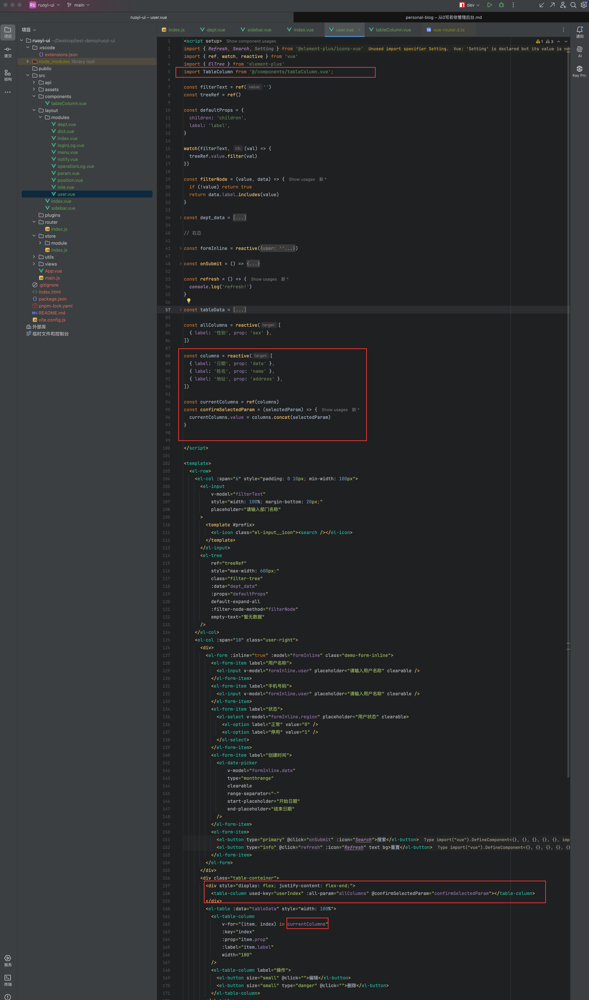

   ```vue
   <script setup>
   import { Refresh, Search, Setting } from '@element-plus/icons-vue'
   import { ref, watch, reactive } from 'vue'
   import { ElTree } from 'element-plus'
   import TableColumn from '@/components/tableColumn.vue';
   
   const filterText = ref('')
   const treeRef = ref()
   
   const defaultProps = {
     children: 'children',
     label: 'label',
   }
   
   watch(filterText, (val) => {
     treeRef.value.filter(val)
   })
   
   const filterNode = (value, data) => {
     if (!value) return true
     return data.label.includes(value)
   }
   
   const dept_data = [
     {
       label: '若依科技',
       children: [
         {
           label: '深圳总公司',
           children: [
             {
               label: '研发部门',
             },
           ],
         },
       ],
     }
   ]
   
   // 右边
   
   const formInline = reactive({
     user: '',
     region: '',
     date: '',
   })
   
   const onSubmit = () => {
     console.log('submit!')
     console.log(columns)
   }
   
   const refresh = () => {
     console.log('refresh!')
   }
   
   const tableData = [
     {
       date: '2016-05-03',
       name: 'Tom',
       address: 'No. 189, Grove St, Los Angeles',
       sex: '男'
     },
     {
       date: '2016-05-02',
       name: 'Tom',
       address: 'No. 189, Grove St, Los Angeles',
       sex: '男'
     },
     {
       date: '2016-05-04',
       name: 'Tom',
       address: 'No. 189, Grove St, Los Angeles',
       sex: '男'
     },
     {
       date: '2016-05-01',
       name: 'Tom',
       address: 'No. 189, Grove St, Los Angeles',
       sex: '男'
     },
   ]
   
   const allColumns = reactive([
     { label: '性别', prop: 'sex' },
   ])
   
   const columns = reactive([
     { label: '日期', prop: 'date' },
     { label: '姓名', prop: 'name' },
     { label: '地址', prop: 'address' },
   ])
   
   const currentColumns = ref(columns)
   const confirmSelectedParam = (selectedParam) => {
     currentColumns.value = columns.concat(selectedParam)
   }
   
   
   </script>
   
   <template>
     <el-row>
       <el-col :span="6" style="padding: 0 10px; min-width: 100px">
         <el-input
             v-model="filterText"
             style="width: 100%; margin-bottom: 20px;"
             placeholder="请输入部门名称"
         >
           <template #prefix>
             <el-icon class="el-input__icon"><search /></el-icon>
           </template>
         </el-input>
         <el-tree
             ref="treeRef"
             style="max-width: 600px;"
             class="filter-tree"
             :data="dept_data"
             :props="defaultProps"
             default-expand-all
             :filter-node-method="filterNode"
             empty-text="暂无数据"
         />
       </el-col>
       <el-col :span="18" class="user-right">
         <div>
           <el-form :inline="true" :model="formInline" class="demo-form-inline">
             <el-form-item label="用户名称">
               <el-input v-model="formInline.user" placeholder="请输入用户名称" clearable />
             </el-form-item>
             <el-form-item label="手机号码">
               <el-input v-model="formInline.user" placeholder="请输入用户名称" clearable />
             </el-form-item>
             <el-form-item label="状态">
               <el-select v-model="formInline.region" placeholder="用户状态" clearable>
                 <el-option label="正常" value="0" />
                 <el-option label="停用" value="1" />
               </el-select>
             </el-form-item>
             <el-form-item label="创建时间">
               <el-date-picker
                   v-model="formInline.date"
                   type="monthrange"
                   clearable
                   range-separator="-"
                   start-placeholder="开始日期"
                   end-placeholder="结束日期"
               />
             </el-form-item>
             <el-form-item>
               <el-button type="primary" @click="onSubmit" :icon="Search">搜索</el-button>
               <el-button type="info" @click="refresh" :icon="Refresh" text bg>重置</el-button>
             </el-form-item>
           </el-form>
         </div>
         <div class="table-container">
           <div style="display: flex; justify-content: flex-end;">
             <table-column used-key="userIndex" :all-param="allColumns" @confirmSelectedParam="confirmSelectedParam"></table-column>
           </div>
           <el-table :data="tableData" style="width: 100%">
             <el-table-column
                 v-for="(item, index) in currentColumns"
                 :key="index"
                 :prop="item.prop"
                 :label="item.label"
                 width="180"
             />
             <el-table-column label="操作">
               <el-button size="small" @click="">编辑</el-button>
               <el-button size="small" type="danger" @click="">删除</el-button>
             </el-table-column>
           </el-table>
         </div>
       </el-col>
     </el-row>
   </template>
   
   <style scoped lang="scss">
   .el-row {
     margin-bottom: 20px;
   }
   .el-row:last-child {
     margin-bottom: 0;
   }
   .el-col {
     border-radius: 4px;
   }
   
   .grid-content {
     border-radius: 4px;
     min-height: 36px;
   }
   
   .demo-form-inline .el-input {
     --el-input-width: 220px;
   }
   
   .demo-form-inline .el-select {
     --el-select-width: 220px;
   }
   
   el-button {
     border: 1px solid black;
   }
   
   .table-container {
     position: relative;
   }
   </style>
   
   ```

   `tableConlume.js`

   

   ```js
   import { defineStore } from 'pinia'
   import { ref } from 'vue'
   
   export const tableColumnStore = defineStore(
     // store 唯一标识
     'tableColumn',
     // 对外暴露信息
     () => {
       // token 初始化
       const tableColumn = ref({})
       
       // 获取
       const getUsedValue = (usedKey) => {
         return tableColumn.value[usedKey] ? tableColumn.value[usedKey] : { selectedParam: [] }
       }
       
       
       // 设置
       const setUsedValue = (userKey, usedValue) => {
         tableColumn.value['usedKey'] = usedValue
       }
       
       // 移除
       const removeUsedValue = (userKey) => {
         tableColumn.value['usedKey'].selectedParam = []
       }
       
       // 对外提供 store 信息
       return {
         getUsedValue,
         setUsedValue
       }
     },
     // 选项配置
     {
       persist: false // 持久化
     }
   )
   
   ```


### 暂时完结

> 没做完为什么完结？
>
> 1. 是`暂时完结`,因为时间不太充裕。
> 2. 个人认为主要设计的内容已经完成（基本布局、接口对接、组件封装、数据持久化）
> 3. 后续有时间的话会继续完成后续（大概率不会全部实现）
>
> 是否认为阑尾？
>
> 不认为。
>
> 因为我会将代码上传的`github`上（包含全后端代码，有人需要练手不是很好的例子吗？刚好主要的都有实例参考，还可以`新手练习`
>
> 代码只会在`github`上，`gitee`暂时不会上传

1. <a href='https://github.com/HiCheer-O/ruoyi-ui'>前端项目地址</a>
2. <a href='https://github.com/HiCheer-O/ruoyi'>后端项目地址</a>
