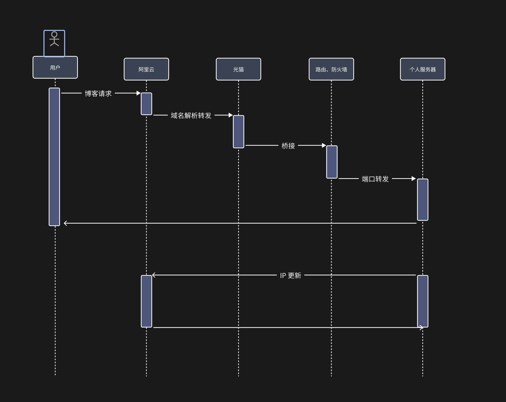

### 前言

> 最近利用 github 搭建了个人博客，发现个人博客图片资源过多导致博客代码仓库体积量增大（我的博客网站的图片没有存储到 OSS 服务器中，直接存储到代码仓库中，从而导致代码仓库体积增长过快），`github pages`官网表明作为`pages`的仓库最大仓库空间是`1GB`，想着后续的博客仓库体积增大将不可以`免费`使用，就想着能不能搭建一个`免费`的博客网站，可以让外网访问。
> 从而我了解到的方案是：搭建家庭个人服务器。然而需要下面三个准备工作，实现该方案。
> 1. 购买域名（当然这个收费，相对较低）
> 2. 家庭宽带申请公网 ip 地址（这个是手机号码套餐中包含的宽带服务、当然这个是动态的 ip）
> 3. DDNS 动态 ip 地址更新

这个方案中的三步都有相对应的详细问题以及相对解决方案，本文章中有介绍。
但是只是简单只是搭建`免费博客网站`，就真的不太符合我爱折腾的兴趣了，然后我就接触到了一些`软路由`的相关信息，然后就基于`软路由`列出了一些方案。这些方案中包含了`科学上网`、`外网访问`、`端口转发`、`私人服务器`等等内容。

***强调一点：*** 这篇文章中目前还没有实际详细的手把手教程。为什么没有呢？因为精力以及资金、空间有限没有时间亲手整理。
文章中只写了关于个人当前需求、以及后续可能存在的需求，整理出的方案，如果后续需要自己真正需要的时候并且有时间的话会给每一个方案整理出详细的教程。

### 开始前预热

1. 购买域名
   > 为什么购买域名？
   > 首先，域名可以作为你的博客域名、或者你的网站域名；例如你购买了`hicheer.cc`的域名，你就可以用它做你的专属域名；如果有				一个网站是关于博客你就可以在之前的域名上添加子域名`blog.hicheer.cc`、购物域名`shop.hicheer.cc`，总之可以全球唯一的个人标签；
   > 其次，很重要的一点。因为我们家庭的公网 ip 是`不断变换`的，因此我们需要将不断变换的 ip 地址映射到一个不变的域名上；
   > 最后，价格相对固定公网 ip `便宜`太多了，一般第一年价格在`个位数`，续费的话一年大概在`80`人民币左右。

⚠️注意一点：国内的域名需要`实名认证`，备案周期在15天左右，也可以使用国外网站注册不用备案、价格差不太多，购买方案这里就不给出步骤了，可以在`阿里云`购买，教程很多。

2. 家庭宽带申请公网 ip 地址
   > 路由器/光猫模式分为：`动态获取`、`桥接`、`拨号上网`，区别自己百度查询，这里不过多讲解。
   > 首先，需要拨打运营商客服电话号，说明为什么要申请公网 ip，然后她会告诉你宽带的`账号和密码`；
   > 然后，需要将进入光猫后台，将`光猫`改为`桥接模式`连接主路由，主路由改为`拨号上网`，（也可以将光猫改为拨号，主路由就不要怎么设置了），总之总有一个设备需要是拨号上网；

⚠️注意：一般我们是无法知道光猫的`超级管理员账号密码`的，因为运营商不会让用户随便修改的，一般默认都是`动态获取`模式，因此没有账号就进不了光猫后台，也就改不了`模式`，可以让宽带师傅帮你将光猫修改为`桥接`，路由器地址你是知道的，路由器模式自己改为拨号上网，输入宽带账号密码就可以上网了。还有光猫背面有一个后台管理账号密码，一般都不是超级管理员的。

3. DDNS 动态 ip 地址更新
   > 这里就是将家庭动态的 ip 地址更新绑定我们的域名。
   > 原理是，在需要访问的内网设备上，不间断的获取公网 ip，对比上次的 ip 是否发生变化，ip 发生改变后更新域名绑定的 ip 地址。
  - 如何获取 公网ip 并判断是否发生改变呢？
    > 在需要访问的设备上（当然也可以是同一网络下的其他设备，因为公网相同）安装相应软件，例如：docker 有相应的容器、linux有相应的进程、win 有相应的软件、还有就是软路由的相关插件
  - 如何修改域名映射的 ip 地址？
    > 以阿里云为例，你需要在阿里云中创建一个子账号，子账号的权限分配只可以修改域名 ip 修改即可，会有账号密码，在使用获取公网 ip 的软件上是可以填写账号密码的，并告诉他是哪个服务上，他自己会发起请求修改的，一般发起请求后阿里云在10分钟内生效（也可能会更长、毕竟免费）

⚠️最后，一定要在你的拨号上网的那个设备上做`ip端口映射`，因为就算阿里云域名解析生效后你那么多设备他是不知道你那台设备
要支持访问外网的，还有支持外网访问的设备端口，如果你的路由器链路很长的话，你的目标服务器与最开始的服务器中间的每台设
备都要配置端口转发，所以建议你拨号的路由直接一条网线链接你的目标服务器，这样没有那么多的转发。
***这个详细步骤，后续会出。***

### 方案-1

- 需求

  > 个人网站可以访问外网访问

  其实就是自己有一台闲置的win电脑，上面安装了 vm 虚拟机，虚拟机中安装了 linux 系统，把博客放到 linux 系统中，外网可以访问。

  

- 相关设备

  > 硬件：光猫、路由、win 电脑
  >
  > 软件：vm 虚拟机、linux 系统、DDNS 软件
  >
  > 其他：域名、公网 ip 申请

- 方案

  

- 步骤

  ***后续会单独出来一篇文章**

### 方案-2

- 需求

  > 个人网站、服务器、广告拦截、TV 支持科学上网、路由 mash 组网

  个人网站、服务器可以外网访问，家庭全部设备广告拦截、TV 可以看 Netflix/Youtube，手机无缝切换网络。

- 相关设备

  > 硬件：光猫、软路由
  >
  > 软件：pev、linux、openwrt、插件（openclash、AdblockPlus、DDNS）
  >
  > 其他：域名、公网 ip 申请

- 方案

  

- 步骤

  ***后续会单独出来一篇文章***，也可以看这个博主的视频讲的很好[All In One](https://www.bilibili.com/video/BV1bc411v7A3/?spm_id_from=333.880.my_history.page.click&vd_source=e8f24299dc23758c11d7829b53bac4bc)，后面大概率会跟着这视频产出文档。
